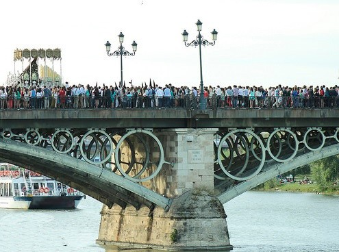

## Enunciado

Observa la aglomeración de personas que se encontraron la pasada Semana Santa en el Puente de Triana.

Sabemos que el puente tiene una altura sobre la rasante de 12 m, su longitud total es de 154,5 m y su ancho de tablero es de 15,9 m.

Estima de forma razonada el número de personas que se encontraron ese día en el Puente de Triana, si al contar el número de personas que hay en varios cuadrados de 2 metros de lado en dicho puente se han obtenido los siguientes datos: 23, 14, 22, 20, 19, 20 y 22.

## Solución

Calculamos cuántas personas hay de media en un metro cuadrado y multiplicamos por la superficie del puente.

Cada cuadrado de 2 m de lado mide $4\ \text{m}^2$. La media de personas por metro cuadrado es

$$\bar{x} = \frac{23 + 14 + 22 + 20 + 19 + 20 + 22}{7 \cdot 4} = \frac{140}{28} = 5\ \text{personas/m}^2.$$

Suponiendo que el tablero es un rectángulo, su superficie es

$$S = 154{,}5 \cdot 15{,}9 = 2456{,}55\ \text{m}^2.$$

Por tanto, $5 \cdot 2456{,}55 = 12\,282{,}75$: en el Puente de Triana había **unas 12 283 personas**.

(La altura sobre la rasante, 12 m, es un dato que no hace falta.)
