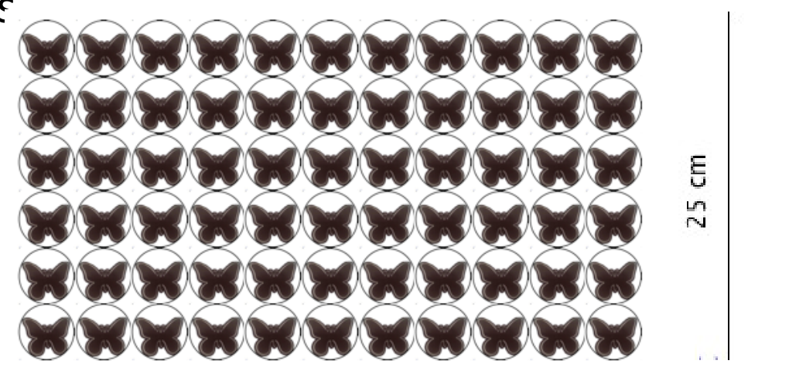

## Enunciado

Con motivo de la próxima llegada de la primavera se quiere decorar un **corcho rectangular de dimensiones 160 cm × 35 cm**.

Para ello se van a recortar pegatinas circulares con una mariposa en su interior de **adhesivos decorativos de vinilo** (como el que se muestra en la imagen) y las vamos a colocar formando coronas circulares sobre el corcho, de forma que no se superpongan.

Contesta de forma razonada:

a) ¿Cuántas coronas circulares completas rellenas de estas pegatinas circulares podríamos obtener sobre el corcho, de forma que ocupen todo el ancho del mismo?

b) ¿Cuántas pegatinas circulares necesitaríamos para rellenar cada una de estas coronas circulares?

c) Si a una de estas coronas la queremos rellenar con otras coronas circulares concéntricas en su interior, formadas igualmente de pegatinas circulares, ¿cuántas coronas circulares concéntricas se podrían obtener?

## Solución

En la lámina caben 6 pegatinas en 25 cm de alto, así que cada pegatina tiene un diámetro de $\frac{25}{6}$ cm.

a) El ancho del corcho, 35 cm, es el mayor diámetro posible de la circunferencia exterior de cada corona. Como $160 : 35 \approx 4{,}57$, caben como máximo **4 coronas completas**, con radio exterior $35/2 = 17{,}5$ cm y radio interior $17{,}5 - \frac{25}{6} \approx 13{,}33$ cm.

b) El ángulo que forman, desde el centro de la corona, las rectas tangentes a una pegatina es de unos 15,6°, y $360° : 15{,}6° \approx 23{,}08$.

Otra aproximación: dividir la longitud de la circunferencia que pasa por los centros de las pegatinas entre el diámetro de una pegatina:

$$\frac{2\pi\,\left(17{,}5 - \frac{25}{12}\right)}{25/6} \approx 23{,}25.$$

Se necesitan unas **23 pegatinas** por corona.

c) Dividimos el radio exterior de la corona entre el diámetro de una pegatina: $\dfrac{35/2}{25/6} = 4{,}2$. Se obtendrían **4 coronas concéntricas**.
