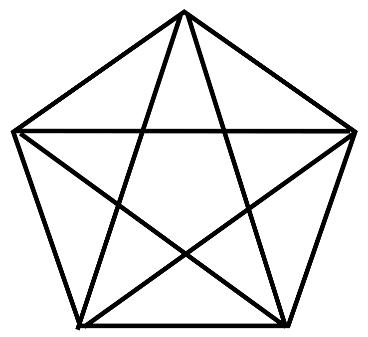

## Enunciado

Carlos, Victoria y Alberto se han enfrascado en una acalorada discusión sobre el número de polígonos de esta figura.

**Carlos:** «Hay más triángulos».

**Victoria:** «¿Cómo va a ser eso posible? Evidentemente, hay más cuadriláteros».

**Alberto:** «¡Pero qué dices! Si está claro que hay más pentágonos».

¿Quién lleva razón? Ordena, de menor a mayor, el número de triángulos, cuadriláteros y pentágonos.

**Razona tu respuesta.**

## Solución

Contando de forma ordenada los polígonos que se pueden formar con los segmentos de la figura se obtienen:

- **35 triángulos**,
- **25 cuadriláteros**,
- **72 pentágonos**.

Por tanto, lleva razón **Alberto**:

$$\text{n.º de cuadriláteros} < \text{n.º de triángulos} < \text{n.º de pentágonos}.$$
