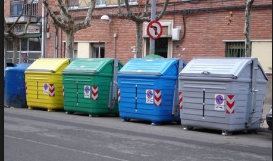

## Enunciado

Rosa saca la basura orgánica todos los días de lunes a viernes, y los envases y plásticos los lunes, miércoles y viernes. Tira los vidrios cada 13 días. Saca el papel y el cartón una vez a la semana, pero si una semana lo hace en martes, la siguiente en miércoles, la siguiente en jueves, y así sucesivamente.

Como en su pueblo los sábados y los domingos no se puede sacar la basura, si le toca en uno de esos días la saca el lunes siguiente.

Rosa, el pasado lunes 2 de mayo, sacó todas las basuras a la vez. ¿Cuándo volverá a sacar otra vez las cuatro?

Cuando acabe el año 2016, ¿cuántas veces habrá sacado las cuatro a la vez este año?

Razona las respuestas.

## Solución

Veamos qué días saca cada tipo de basura a partir de un lunes en que coinciden todas:

- **Orgánica:** todos los días de lunes a viernes.
- **Envases y plásticos:** lunes, miércoles y viernes.
- **Vidrio:** cada 13 días. Trece días después de un lunes es domingo, así que lo saca el lunes siguiente: **cada 2 lunes**.
- **Papel y cartón:** la semana siguiente en martes, luego miércoles, jueves y viernes; la siguiente le tocaría en sábado y pasa al lunes: **cada 6 lunes**.

Todas coinciden siempre en lunes: orgánica y envases todos los lunes, vidrio cada 2 lunes y cartón cada 6. Por tanto, **coinciden las cuatro cada 6 lunes**. Desde el lunes 2 de mayo, seis semanas después es el **lunes 13 de junio**.

Un año tiene 52 semanas y algún día más. Si coincidieran en la 1.ª semana, volverían a coincidir en las semanas 7.ª, 13.ª, 19.ª, 25.ª, 31.ª, 37.ª, 43.ª y 49.ª: 9 veces. Pero si la primera coincidencia es en la semana 5.ª o 6.ª, solo coinciden 8 veces.

En 2016, contando hacia atrás desde el 2 de mayo de 6 en 6 semanas, la primera coincidencia fue el 6.º lunes del año (8 de febrero). Al acabar el año habrá sacado las cuatro basuras a la vez **8 veces**.
