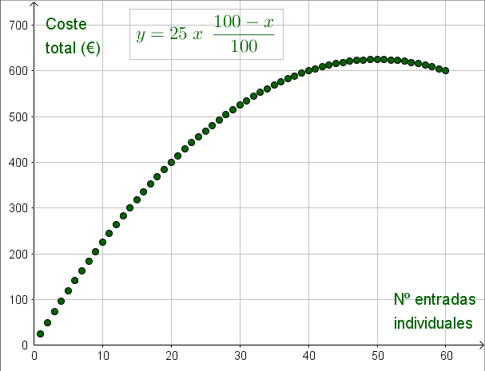

## Enunciado

Un grupo de 42 olímpicos desean ir a la Casa de la Ciencia; para ello piden información sobre los precios y obtienen la siguiente información:

| N.º de entradas | Precio |
|---|---|
| **Entradas individuales** (máximo 60) | |
| 1 entrada | 25 € |
| 2 entradas | Descuento de un 2 % del total |
| 3 entradas | Descuento de un 3 % del total |
| $n$ entradas | Descuento de un $n$ % del total |
| **Ofertas de grupo** | |
| 10 entradas | 220 € |
| 15 entradas | 315 € |
| 20 entradas | 410 € |

Nota: además, les informan de que por cada 15 entradas compradas les regalan una.

De todas las formas posibles de comprar las entradas para los 42 olímpicos, ¿cuál sería la más económica para el grupo?

Razona la respuesta.

## Solución

Como regalan 1 entrada por cada 15, con dos grupos completos de 15 los 42 olímpicos solo necesitan **comprar 40 entradas**.

Precio por persona en cada opción:

- Grupos de 10: $220 : 10 = 22$ €.
- Grupos de 15: $315 : 15 = 21$ €.
- Grupos de 20: $410 : 20 = 20{,}50$ €.
- 40 entradas individuales (40 % de descuento): $0{,}6 \cdot 25 = 15$ €.

La mejor opción parece comprar 40 entradas individuales, por $40 \cdot 15 = 600$ €. Pero cuantas más entradas individuales se compran, mayor es la rebaja. ¿Hay otra posibilidad igual de barata?

Comprando $x$ entradas individuales, el coste total es

$$y = 25\,x \cdot \frac{100 - x}{100}.$$

Buscamos $x \le 60$ con $y \le 600$. Representando la función se ve que el coste crece hasta $x = 50$ y luego decrece, y que vuelve a valer 600 € en $x = 60$: $25 \cdot 60 \cdot 0{,}4 = 600$ €.

Hay **dos opciones igual de económicas**: comprar 40 entradas individuales o comprar 60, ambas por **600 €**.
