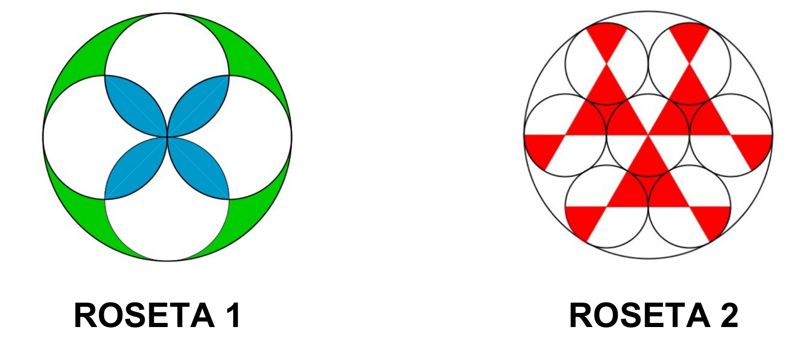

## Enunciado

En el próximo aniversario de su fundación, la Junta Directiva del Real Club Recreativo Thales quiere adornar la fachada con dos tipos de rosetas, que están inscritas en circunferencias de 3 cm de radio, como las que aparecen dibujadas en las figuras adjuntas:

Si se han utilizado 10,27 cm² de azulejos, entre azul y verde, en la primera roseta, ¿cuál de las zonas coloreadas en ambas rosetas saldría más económica, si el precio es el mismo sea cual sea el color?

**Razona la respuesta.**

## Solución

Hay que calcular el área de la parte roja de la segunda roseta, formada por 3 triángulos equiláteros cuyo lado es $\frac{2}{3}$ del radio de la circunferencia, y 6 segmentos circulares iguales.

1. **Triángulos.** El lado de cada triángulo es $\frac{2}{3} \cdot 3 = 2$ cm. Por Pitágoras, su altura es $h = \sqrt{2^2 - 1^2} = \sqrt{3} \approx 1{,}73$ cm, y su área

   $$A = \frac{2 \cdot 1{,}73}{2} = 1{,}73\ \text{cm}^2.$$

2. **Segmentos circulares.** Los seis segmentos juntos forman un círculo completo de los interiores, cuyo radio es $\frac{1}{3}$ del radio exterior, es decir, 1 cm:

   $$A = \pi \cdot 1^2 \approx 3{,}14\ \text{cm}^2.$$

3. **Zona roja.**

   $$A_{\text{roja}} = 3 \cdot 1{,}73 + 3{,}14 = 8{,}33\ \text{cm}^2.$$

Como $10{,}27\ \text{cm}^2 > 8{,}33\ \text{cm}^2$, es más económica la zona coloreada de la **roseta 2**.
