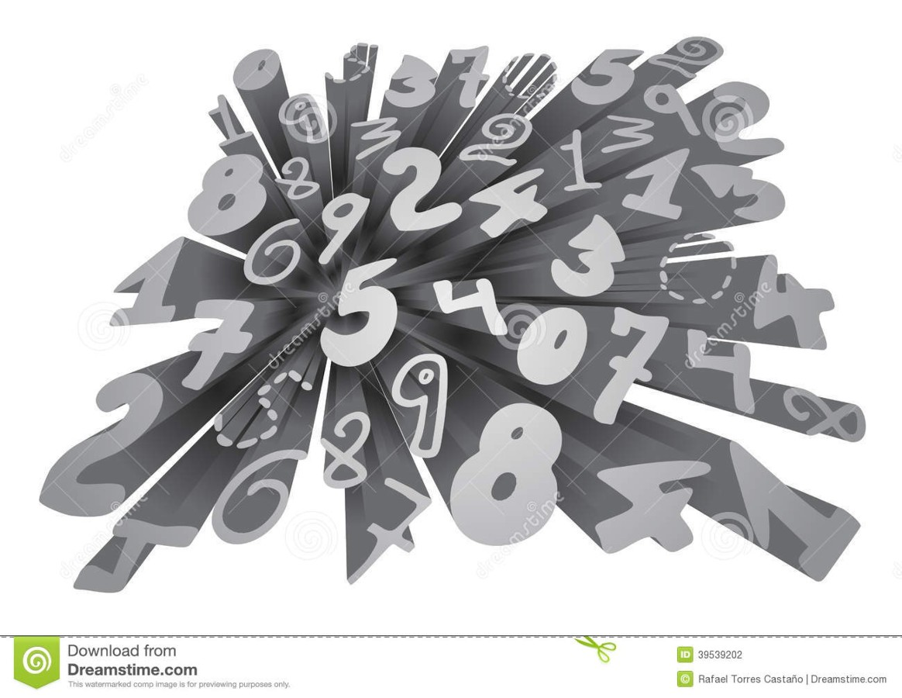
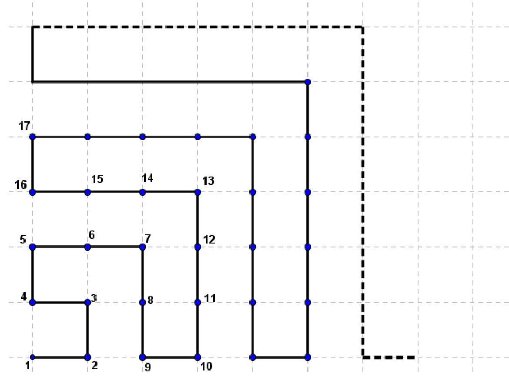

## Enunciado

Todos sabemos que los pitagóricos estaban obsesionados con los números.

Pitágoras le propuso a uno de sus discípulos aventajados el siguiente juego a modo de rejilla. Los puntos de la rejilla (representada en la figura) están numerados siguiendo la trayectoria marcada.

¿Cuál es el número que se encuentra a la derecha de 2016? ¿Y a la izquierda?

**Razona las respuestas.**

## Solución

En la fila horizontal de abajo están los cuadrados de los números impares, intercalados con esos mismos cuadrados más 1:

$$1^2 = 1,\ 3^2 = 9,\ 5^2 = 25,\ 7^2 = 49, \dots \qquad 1^2 + 1 = 2,\ 3^2 + 1 = 10,\ 5^2 + 1 = 26, \dots$$

En la columna vertical de la izquierda están los cuadrados de los números pares, intercalados con esos cuadrados más 1:

$$2^2 = 4,\ 4^2 = 16,\ 6^2 = 36, \dots \qquad 2^2 + 1 = 5,\ 4^2 + 1 = 17,\ 6^2 + 1 = 37, \dots$$

La raíz cuadrada de 2016 está entre 44 y 45. El número $45^2 = 2025$ está al final de una vertical descendente, sobre la horizontal; como $2016 = 2025 - 9$, el 2016 está nueve puntos por encima de la horizontal en esa columna.

- **A la derecha** de 2016 está la vertical ascendente que empieza en $45^2 + 1 = 2026$. Nueve puntos por encima de la horizontal está $2026 + 9 = \mathbf{2035}$.
- **A la izquierda** está la vertical ascendente que empieza en $43^2 + 1 = 1850$. Nueve puntos más arriba está $1850 + 9 = \mathbf{1859}$.
