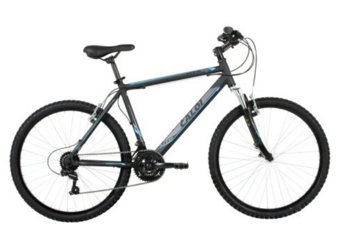

## Enunciado

En el escaparate de una tienda de bicicletas figura el siguiente escrito:

Se regalará una bicicleta a la primera persona que resuelva este acertijo: «¿Qué cinco números enteros positivos, al sumarlos por parejas, dan como resultado siempre una de estas tres cantidades: 21, 28 o 35?».

Halla cuáles son esos números y serás tú el afortunado.

**Razona la respuesta.**

Nota: los números buscados pueden repetirse o no.

## Solución

Algún número tiene que repetirse: con cinco números distintos, las sumas de parejas dan al menos 4 resultados distintos (por ejemplo, con 1, 2, 3, 4 y 5).

Si un número $a$ se repite, la suma $a + a$ es una de las tres cantidades, así que es par: solo puede ser 28, es decir, $a = 14$. Sumado con los demás números, el 14 debe dar 21, 28 o 35, así que los otros números solo pueden ser $21 - 14 = 7$, $14$ o $35 - 14 = 21$. Además, 7 y 21 solo pueden aparecer una vez cada uno (7 + 7 = 14 y 21 + 21 = 42 no valen), así que el 14 se repite tres veces.

Los números son **7, 14, 14, 14 y 21**: sus sumas por parejas son 21, 28 y 35.
