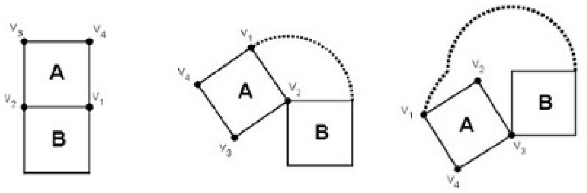
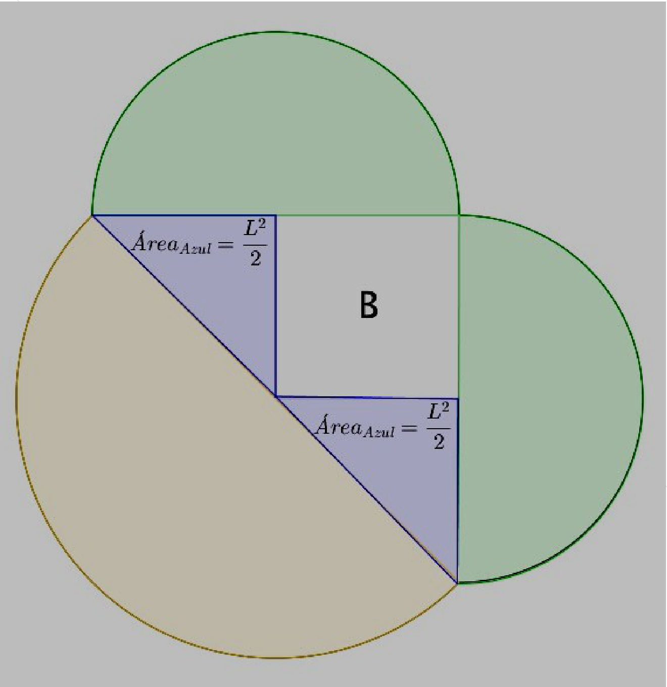

## Enunciado

El señor Eucli Despistado ha diseñado el logo de su empresa, *Elements Solutions*, de la siguiente manera.

Partiendo de dos cuadrados, A y B, de 3,2 centímetros de lado, que tienen un lado en común (como muestra la figura), gira el cuadrado A sobre el vértice $V_2$ en el sentido contrario a las agujas del reloj. Cuando vuelven a coincidir los lados, vuelve a girar el cuadrado en el mismo sentido, esta vez sobre el vértice $V_3$. Continúa el proceso hasta que el vértice $V_1$ regresa a su punto inicial.

El logo que ha obtenido es la figura que encierra la curva que describe el vértice $V_1$ del cuadrado A al girar.

Realiza un dibujo del logo diseñado por Eucli y calcula su superficie.

**Razona tus respuestas.**

## Solución

El vértice $V_1$ describe tres arcos: una semicircunferencia de radio $L$ (el lado del cuadrado B) con centro en $V_2$, otra de radio la diagonal de B, $L\sqrt{2}$, con centro en $V_3$, y otra de radio $L$ con centro en $V_4$.

El logo se descompone en:

- el cuadrado B: $L^2$;
- dos semicírculos de radio $L$ (en verde): $2 \cdot \frac{\pi L^2}{2} = \pi L^2$;
- un semicírculo de radio $L\sqrt{2}$ (marrón): $\frac{\pi\,(L\sqrt{2})^2}{2} = \pi L^2$;
- dos triángulos rectángulos de catetos $L$ (en azul): $2 \cdot \frac{L^2}{2} = L^2$.

En total, $2L^2 + 2\pi L^2 = 2L^2\,(1 + \pi)$. Con $L = 3{,}2$ cm, $L^2 = 10{,}24$ cm² y la superficie es

$$2 \cdot 10{,}24 \cdot (1 + \pi) \approx \mathbf{84{,}82\ cm^2}.$$
