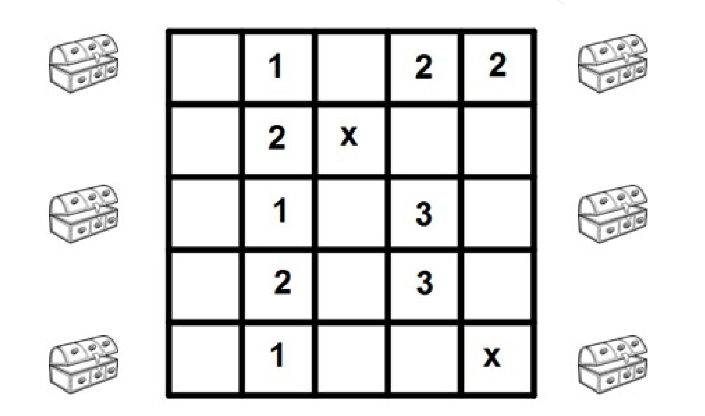
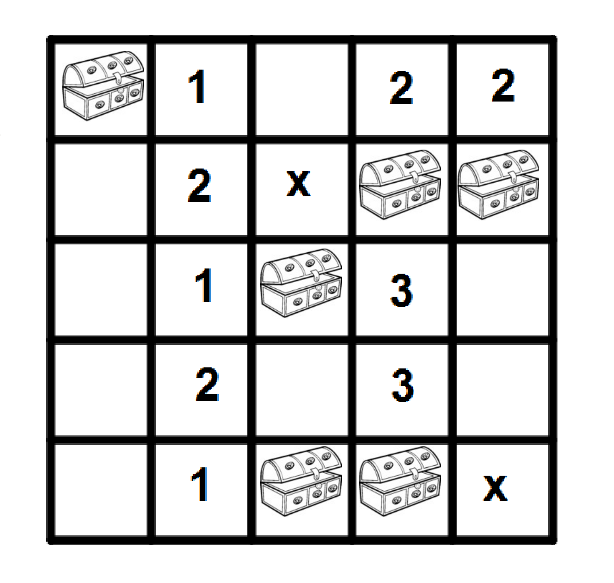

## Enunciado

El jardín de Matelandia se ha dividido en 25 cuadrículas como las de la figura y se han escondido seis tesoros en seis cuadrículas diferentes.

Tras múltiples averiguaciones hemos podido reducir a 14 el número de cuadrículas donde pueden estar escondidos los tesoros, que se corresponden con las casillas en blanco del dibujo.

Los números indican la cantidad de tesoros que hay alrededor de la casilla numerada (en las 8 casillas que la rodean), y las X indican que en esas casillas no está el tesoro. Coloca cada uno de los seis tesoros en su casilla, **explicando de forma razonada** por qué has deducido que deben ir ahí.

## Solución

Se razona como en el buscaminas, empezando por las casillas numeradas que dejan menos posibilidades:

- El **2 de la esquina superior derecha** solo tiene dos casillas libres alrededor: las dos de debajo. Ahí hay dos tesoros.
- El **2 de la fila 1** ya tiene esos dos tesoros alrededor, así que las demás casillas que lo rodean están vacías.
- El **1 de la primera fila** tiene dos casillas posibles; si se elige la que no es, después no se pueden cumplir los números de la segunda columna. El tercer tesoro va en la esquina superior izquierda.
- Los **3** de la cuarta columna obligan a colocar tesoros a su alrededor, y los **2 y 1** de la segunda columna dejan una única posibilidad para los tres últimos.

Los tesoros están en: la esquina superior izquierda; las casillas 4.ª y 5.ª de la segunda fila; la 3.ª casilla de la tercera fila, y las casillas 3.ª y 4.ª de la última fila.
