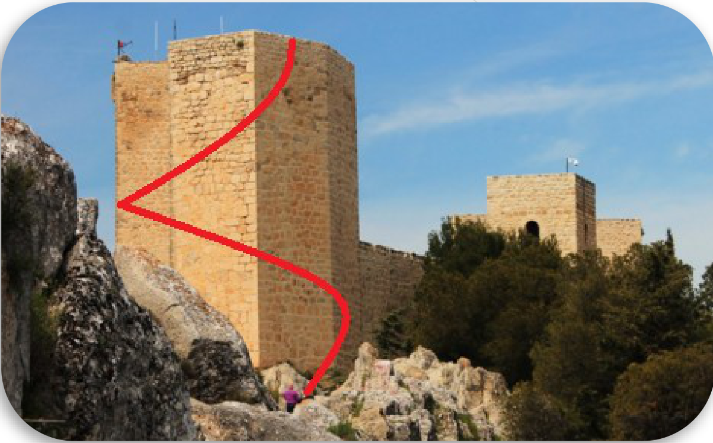

## Enunciado

En el castillo de Santa Catalina de Jaén podemos ver seis torres, llamadas Torre del Homenaje, Torre de las Damas, Torre de la Vela, Torre de las Troneras y las dos Torres Albarranas.

Si las pudiéramos poner una encima de otra, medirían en total 124,5 metros. Sabemos que la Torre del Homenaje mide más de 30 metros de altura y que, si las ordenáramos, la diferencia entre dos torres consecutivas en tamaño es de cuatro metros y medio. ¿Cuál será la altura de las demás torres?

El interior de una de las torres albarranas del castillo es cilíndrico. Aunque no es muy ancho, tiene 8 metros de diámetro y una altura de 9,5 metros. Laura y Lucas subieron a lo alto de la torre por una rampa pegada a la pared interior. Comprobaron que la rampa, de pendiente constante, terminaba justo encima de donde empezaba. Calcula la longitud de dicha rampa.

**Razona las respuestas.**

## Solución

**Alturas.** La torre albarrana mide 9,5 m, y las alturas van aumentando de 4,5 en 4,5 m:

$$9{,}5;\ 14;\ 18{,}5;\ 23;\ 27{,}5;\ 32\ \text{m},$$

que suman 124,5 m. La más alta, de 32 m, es la Torre del Homenaje. (Si empezáramos por debajo, con 5 m, la más alta no llegaría a 30 m.)

**Rampa.** Si desplegamos el cilindro, la rampa es la diagonal de un rectángulo cuya base es la longitud de la circunferencia, $8\pi \approx 25{,}13$ m, y cuya altura es 9,5 m. Por Pitágoras:

$$\text{rampa} = \sqrt{(8\pi)^2 + 9{,}5^2} \approx \mathbf{26{,}87\ m}.$$

Si la rampa diera dos vueltas completas, serían dos diagonales de rectángulos de 4,75 m de alto: $2\sqrt{(8\pi)^2 + 4{,}75^2} \approx 51{,}16$ m.
