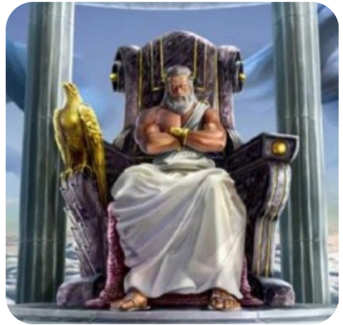

## Enunciado

Hubo originalmente en Occidente una reunión de los seguidores de los hijos más poderosos del titán Cronos, Zeus, Hades y Poseidón, para disputarse el Trono de Plata y, con él, el gobierno del paraíso de los Campos Elíseos.

Sabemos que los seguidores de Hades y Poseidón juntos son el doble que los seguidores de Zeus. Los seguidores de Zeus y Poseidón son ocho veces el número de seguidores de Hades. El número de seguidores de Poseidón supera en 55 a la suma de los seguidores de Zeus y Hades.

Averigua el número total de asistentes a esa reunión y cuántos seguidores de cada hijo acudieron.

**Razona las respuestas.**

## Solución

Llamamos $Z$, $H$ y $P$ a los seguidores de Zeus, Hades y Poseidón:

$$H + P = 2Z, \qquad Z + P = 8H, \qquad P = Z + H + 55.$$

Sustituyendo la tercera en las otras dos:

$$2H - Z = -55, \qquad 2Z - 7H = -55.$$

Multiplicando la primera por 2 y sumando: $-3H = -165$, así que $H = 55$. Entonces $Z = 2 \cdot 55 + 55 = 165$ y $P = 165 + 55 + 55 = 275$.

Acudieron **165 seguidores de Zeus, 55 de Hades y 275 de Poseidón**: en total, **495 asistentes**.
