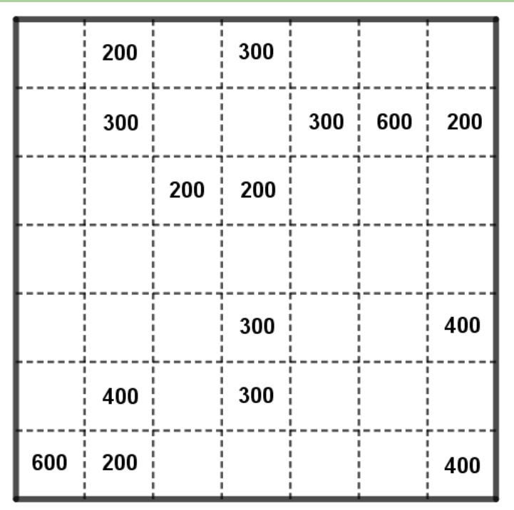
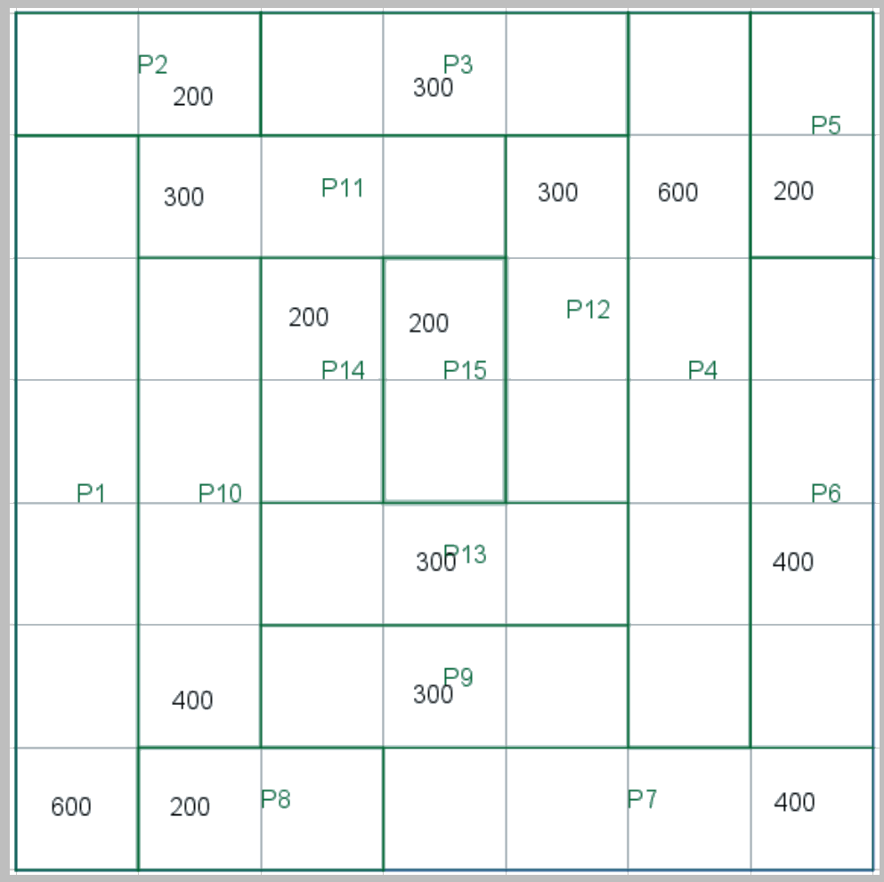

## Enunciado

El huerto urbano de Matelandia, que es un cuadrado de 70 × 70 m, se ha inundado y hay que volver a señalar los límites de las parcelas que lo forman.

Sabemos cuántos metros cuadrados medía cada una, y que las parcelas son rectangulares o cuadradas.

Usa la siguiente cuadrícula para dibujar, **de forma razonada**, las quince parcelas. Cada parcela incluirá un solo número, que representará su área.

## Solución

Cada casilla de la cuadrícula mide $10 \times 10 = 100\ \text{m}^2$, así que una parcela de 300 m² ocupa 3 casillas, una de 600 m², 6, etc.

Hay que empezar por las parcelas que solo se pueden colocar de una manera. Por ejemplo, la de 600 m² de la esquina inferior izquierda solo puede ser un rectángulo de 1 × 6 casillas (10 × 60 m) a lo largo del borde, y a partir de ahí se van reduciendo las posibilidades de las demás: la de 200 m² de arriba cubre el hueco que deja la anterior, la de 300 m² de arriba solo tiene una opción, después la otra de 600 m², etc.

