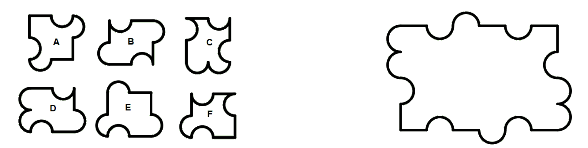
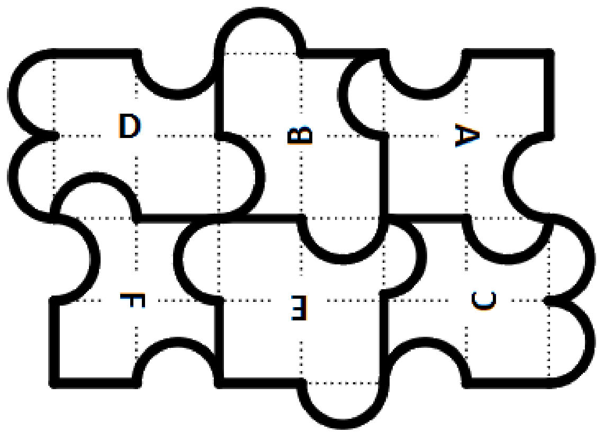

## Enunciado

Para la nueva campaña de primavera se está diseñando un juego que las sociedades iberoamericanas van a poner a la venta. Se trata de un puzle muy curioso, con solo seis piezas que podremos girar para completar el panel.

No todas las piezas tienen la misma área: **encuentra razonadamente** la pieza de mayor área y, también **de forma razonada**, la de menor área.

Además, completa el puzle teniendo en cuenta que las piezas se pueden girar. Si giras alguna pieza, indícalo girando también la letra de la pieza.

## Solución

Cuadriculando las piezas se ve que todas parten de un cuadrado de 4 unidades de área, al que se le añaden o quitan salientes y entrantes semicirculares iguales:

- A y B: 4 unidades (sus entrantes y salientes se compensan).
- C: 4 unidades menos medio círculo.
- D: 4 unidades más medio círculo.
- E: 4 unidades más un círculo.
- F: 4 unidades menos un círculo.

Por tanto, $F < C < A = B < D < E$: **la de mayor área es la E y la de menor, la F**.

Para completar el puzle conviene cuadricular también el panel y empezar por las esquinas y las piezas centrales: A (girada 90° en sentido horario) arriba a la derecha, F (girada igualmente) abajo a la izquierda, E (girada 180°) abajo en el centro, C (girada 90° en sentido antihorario) abajo a la derecha, D sin girar arriba a la izquierda y B (girada 90°) arriba en el centro.

Como el panel es simétrico respecto de su centro, empezar colocando la A abajo y la F arriba lleva a la misma solución girada 180°.
