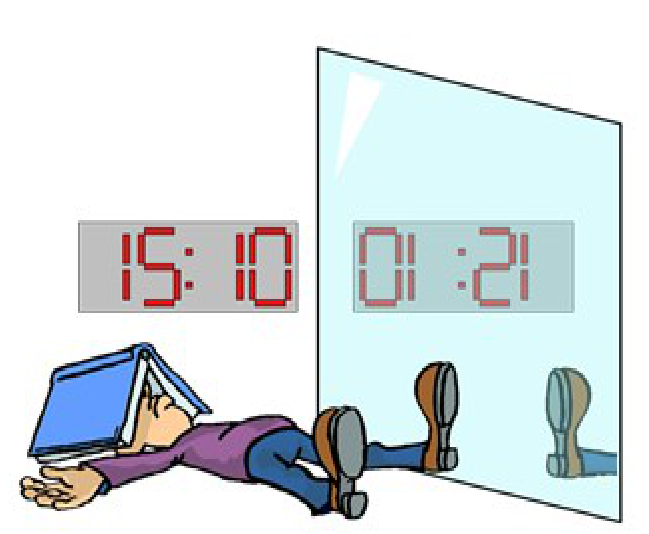
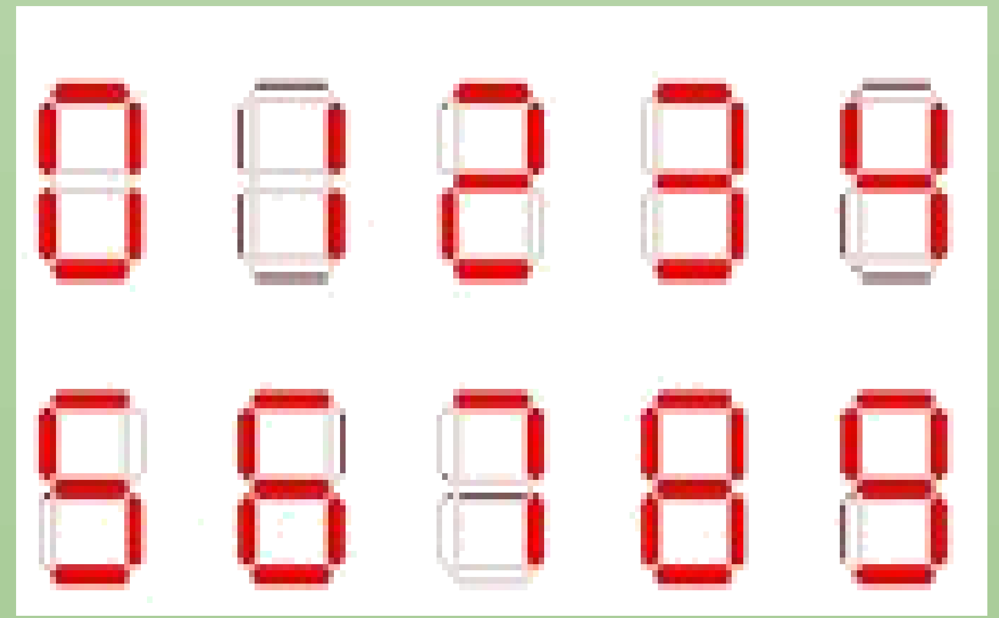

## Enunciado

Eulercín Vaguín se encuentra resolviendo unos aburridos ejercicios de ecuaciones. En un instante en el que ha levantado la vista del papel, a las 3 y 10 de la tarde, ha mirado el espejo que tiene al lado de un reloj digital y se ha dado cuenta de que la hora que podía observarse en el espejo era una hora que podía leerse correctamente (las 01:21).

a) ¿Cuántas y cuáles horas reflejadas en el espejo dan una hora que puede leerse correctamente?

b) ¿Cuántas y cuáles horas reflejadas permanecen invariantes, es decir, se leen igual en el reloj y en el espejo?

**Razona tus respuestas.**

**Nota:** todas las horas del reloj tienen el siguiente formato, que no coincide con un reloj digital real:

## Solución

Al reflejarse en el espejo, el orden de las cifras se invierte y cada cifra se ve simétrica. Con este formato, las únicas cifras que siguen siendo cifras al reflejarse son el 0, el 1 y el 8 (que se quedan igual) y el 2 y el 5 (que se transforman la una en la otra). Por ejemplo, 15:10 se ve como 01:21.

a) Si el reloj marca $h_1h_2:m_1m_2$, en el espejo se lee $m_2'm_1':h_2'h_1'$, donde $x'$ es el simétrico de la cifra $x$.

- Las **horas** del espejo salen de los minutos del reloj. Como $m_1 \le 5$, la segunda cifra de la hora reflejada, $m_1'$, solo puede ser 0, 1, 2 o 5; la primera, 0, 1 o 2. Hay 11 horas posibles: 00, 01, 02, 05, 10, 11, 12, 15, 20, 21, 22.
- Los **minutos** del espejo salen de la hora del reloj. Como $h_1 \le 2$, la segunda cifra, $h_1'$, solo puede ser 0, 1 o 5; la primera, 0, 1, 2 o 5, y el 25 queda excluido porque procedería de la hora 25. Hay 11 posibilidades: 00, 01, 05, 10, 11, 15, 20, 21, 50, 51, 55.

Como cada hora puede combinarse con cada minuto, hay $11 \cdot 11 = 121$ **horas reflejadas** que se leen correctamente (de 00:00 a 22:55).

b) La hora es invariante cuando $m_2' = h_1$ y $m_1' = h_2$, es decir, cuando los minutos son el reflejo de la hora. Hay **11**: 00:00, 01:10, 02:50, 05:20, 10:01, 11:11, 12:51, 15:21, 20:05, 21:15 y 22:55.
