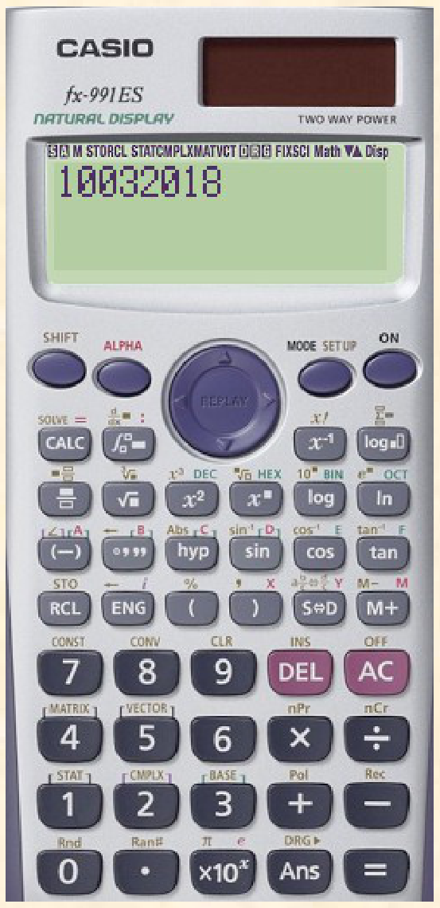
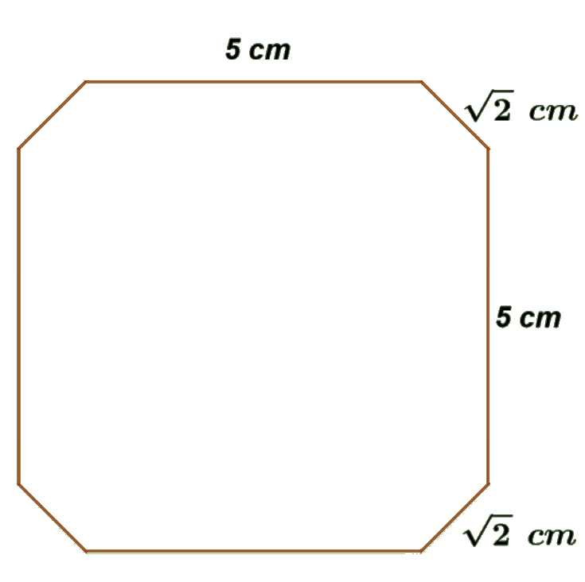

## Enunciado

En Todolandia, con motivo del congreso anual de diseñadores, se están fabricando unas insignias ideadas por María Diseñalotodo, famosa por todas sus innovadoras realizaciones en joyería.

Como se puede apreciar en la imagen, la insignia tiene forma de octógono irregular con las siguientes dimensiones: todos sus lados mayores tienen una longitud de 5 cm y todos los pequeños de $\sqrt{2}$ cm.

Para su realización, María Diseñalotodo dispone en su taller de joyería de una docena de láminas cuadradas de plata de 12,25 dm² cada una. ¿Podrías ayudarla, hallando la superficie que tiene una de estas insignias y así poder calcular cuántas se obtendrían con todas las láminas que posee?

**Razona todas las respuestas.**

## Solución

Los lados pequeños son las hipotenusas de cuatro triángulos rectángulos isósceles que se han cortado en las esquinas de un cuadrado. Si sus catetos miden $c$, por el teorema de Pitágoras $c^2 + c^2 = 2$, luego $c = 1$ cm. El cuadrado de partida tiene de lado $1 + 5 + 1 = 7$ cm, y el área de la insignia es

$$7^2 - 4 \cdot \frac{1 \cdot 1}{2} = 49 - 2 = 47\ \text{cm}^2.$$

Cada lámina mide 12,25 dm² = 1225 cm², es decir, es un cuadrado de 35 cm de lado. En ella caben $5 \cdot 5 = 25$ cuadrados de 7 cm, de cada uno de los cuales sale una insignia. Con las doce láminas se obtienen $12 \cdot 25 = 300$ **insignias**.
