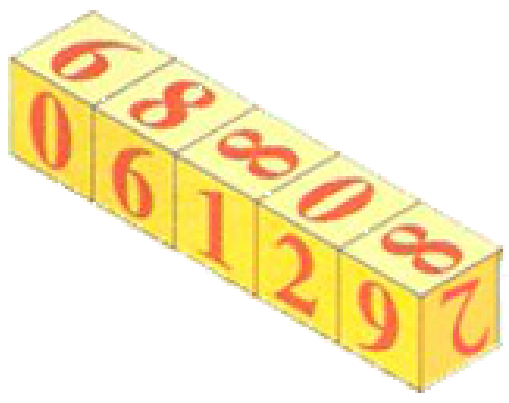

## Enunciado

Estos cinco dados puestos en fila son iguales.

a) Si ves el número de frente, leerás el 06129 (seis mil ciento veintinueve). ¿Qué número leerás si los miras por el lado contrario?

Si ponemos en fila dos dados (como los de la imagen) podemos formar los números 10 y 11. El 10 tiene 4 divisores (1, 2, 5, 10): la mitad son pares y la otra mitad impares. El 11, como buen número primo, solo tiene dos divisores, el 1 y el 11, y los dos impares.

b) De los números que puedes leer al poner dos dados «raros» en fila, busca los que cumplen la propiedad del 10 (la mitad de sus divisores son pares y la otra mitad son impares).

c) ¿Hay algún número primo que puedas leer en los dados que cumpla dicha propiedad?

**Razona todas tus respuestas.**

## Solución

Primero reconstruimos el desarrollo del dado. El 8 es la cara que más aparece; lo ponemos en el centro. Las caras que tocan al 8 en horizontal son el 9 y el 1, y en vertical el 2 y el 6; la que falta, el 0, es la opuesta al 8. Las caras opuestas son, por tanto, 9 y 1, 2 y 6, 8 y 0.

a) Por el lado contrario los dados se leen en orden inverso y en cada uno se ve la cara opuesta: 9, 2, 1, 6, 0 pasan a ser 1, 6, 9, 2, 8. Se lee **16928**.

b) Con dos dados se pueden leer los 36 números formados con las cifras 0, 1, 2, 6, 8, 9 (00, 01, 02, 06, 08, 09, 10, 11, …, 98, 99). Los impares no tienen divisores pares, así que no cumplen la propiedad; tampoco el 00. Si un número par es $2^k \cdot m$ con $m$ impar, por cada divisor impar $d$ de $m$ tiene $k$ divisores pares ($2d, 4d, \dots$), así que cumple la propiedad exactamente cuando $k = 1$, es decir, cuando es el doble de un número impar. Los que la cumplen son:

**02, 06, 10, 18, 22, 26, 62, 66, 82, 86, 90 y 98.**

Por ejemplo, 18 tiene los divisores 1, 3, 9 (impares) y 2, 6, 18 (pares); en cambio, 20 solo tiene dos divisores impares (1 y 5) y cuatro pares (2, 4, 10, 20).

c) Un primo con la propiedad debe tener un divisor par y otro impar: solo el **2** (02).
