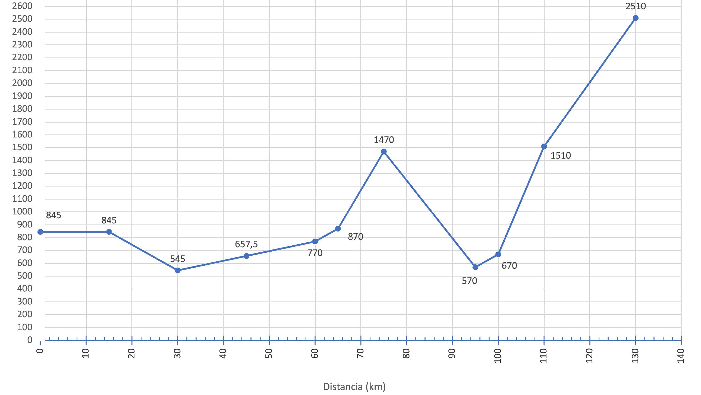

## Enunciado

En la última vuelta ciclista a España, en su etapa Alcalá la Real (845 m) - Alto Hoya de la Mora (Monachil, Sierra Nevada), los participantes tuvieron que recorrer 130 km y debieron superar varios puertos de montaña con diferentes pendientes. Utilizando la tabla siguiente, dibuja el perfil de la etapa.

| Km        | 0  | 15 | 30  | 45    | 60    | 65 | 75 | 95    | 100 | 110  | 130 |
|-----------|----|----|-----|-------|-------|----|----|-------|-----|------|-----|
| Pendiente | 0% | 0% | −2% | 0,75% | 0,75% | 2% | 6% | −4,5% | 2%  | 8,4% | 5%  |

**Razona la respuesta.**

## Solución

La pendiente es el desnivel, en metros, por cada 100 m recorridos en horizontal: una pendiente del 15 % significa subir 15 m en 100 m. Por proporcionalidad, en 20 m se subirían $\frac{20 \cdot 15}{100} = 3$ m.

Aplicando la pendiente de cada punto al tramo que termina en él (por ejemplo, del km 15 al 30 hay 15 000 m al −2 %, un desnivel de −300 m) obtenemos las altitudes:

| Distancia (km) | Pendiente | Variación (m) | Altitud (m) |
|----------------|-----------|---------------|-------------|
| 0              | 0 %       | 0             | 845         |
| 15             | 0 %       | 0             | 845         |
| 30             | −2 %      | −300          | 545         |
| 45             | 0,75 %    | 112,5         | 657,5       |
| 60             | 0,75 %    | 112,5         | 770         |
| 65             | 2 %       | 100           | 870         |
| 75             | 6 %       | 600           | 1470        |
| 95             | −4,5 %    | −900          | 570         |
| 100            | 2 %       | 100           | 670         |
| 110            | 8,4 %     | 840           | 1510        |
| 130            | 5 %       | 1000          | 2510        |

Uniendo los puntos obtenemos el perfil de la etapa, que termina en Hoya de la Mora a 2510 m:

