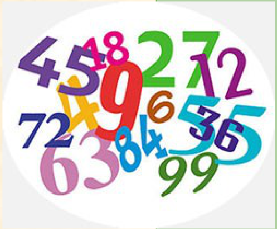

## Enunciado

En la clase de 2.º ESO, el profesor de Matemáticas les dice a los alumnos:

- que cada uno piense un número **natural** y lo ponga en una casilla A;
- luego, que coja ese número, lo multiplique por 2 y al resultado le sume 2, y lo ponga en una casilla B;
- que coja otra vez el número de la casilla A, lo multiplique por 3 y lo ponga en una casilla C;
- ahora, que sume los números de las casillas B y C, multiplique esa suma por 5 y al resultado le reste 3: ese es el resultado final.

**Contesta de forma razonada:**

a) Si un alumno escogió el 7 en la casilla A, ¿cuál ha sido su resultado final?

b) Si un alumno obtuvo como resultado final 57, ¿qué número escogió en la casilla A?

c) Un alumno dice que su resultado final fue 86, ¿puede ser posible?

## Solución

Si en la casilla A está el número $x$, en B está $2x + 2$ y en C, $3x$. El resultado final es

$$5\,\big((2x + 2) + 3x\big) - 3 = 5(5x + 2) - 3 = 25x + 7.$$

a) Con $x = 7$: $25 \cdot 7 + 7 = 182$.

b) $25x + 7 = 57 \Rightarrow 25x = 50 \Rightarrow x = 2$.

c) $25x + 7 = 86 \Rightarrow 25x = 79$, y 79 no es múltiplo de 25: **no es posible**, porque $x$ tiene que ser natural. (Los resultados posibles son 32, 57, 82, 107, …)
