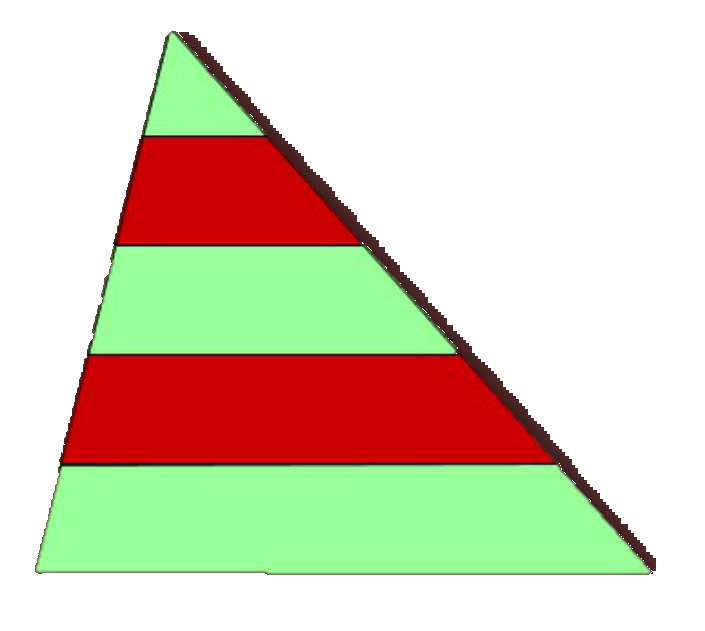
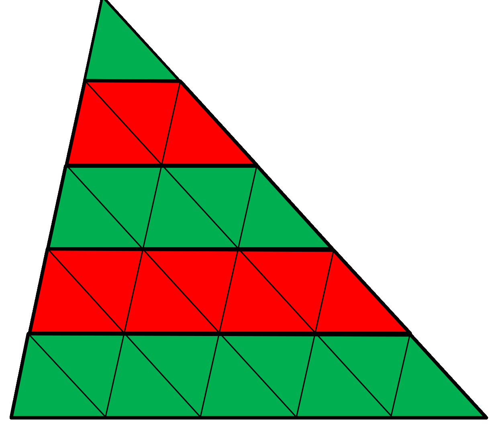

## Enunciado

Darrow es un agricultor que está intentando hacerse un hueco en el mercado de productos exóticos en Marte. Hace poco compró una finca triangular cerca del Monte Olimpo (que es el mayor volcán del Sistema Solar) y la plantó como muestra la figura.

La finca la dividió en cinco bandas paralelas con la misma anchura. La parte más oscura la ha plantado con hemantos de Mercurio y la parte más clara, con acelga plutoniana.

Sabiendo que el área total de la finca es de 145 metros cuadrados, contesta de forma razonada: ¿cuál es el área que ha plantado con hemantos?

## Solución

**Descomponiendo la figura.** Trazando paralelas a los otros dos lados por los puntos de división, el triángulo queda dividido en 25 triángulos iguales al de arriba: la banda $k$-ésima (contando desde el vértice) contiene $2k - 1$ de ellos, es decir, 1, 3, 5, 7 y 9.

Las bandas oscuras son la segunda y la cuarta, con $3 + 7 = 10$ triángulos pequeños, que son $\frac{10}{25} = \frac{2}{5}$ de la finca. El área plantada con hemantos es

$$\frac{2}{5} \cdot 145 = 58\ \text{m}^2.$$

**Con semejanza.** Los triángulos que van desde el vértice superior hasta cada una de las paralelas están en posición de Thales, con alturas proporcionales a 1, 2, 3, 4 y 5; por tanto, sus áreas son $a$, $4a$, $9a$, $16a$ y $25a$. Como $25a = 145$, $a = 5{,}8$ m², y la zona oscura mide $(4a - a) + (16a - 9a) = 10a = 58$ m².

**Pensando un poco más.** Si juntamos al triángulo otro igual girado 180°, se forma un paralelogramo dividido en cinco bandas iguales, dos de ellas oscuras: la zona oscura es $\frac{2}{5}$ del paralelogramo y, por tanto, también $\frac{2}{5}$ de la finca.

Darrow ha plantado **58 m²** de hemantos.
