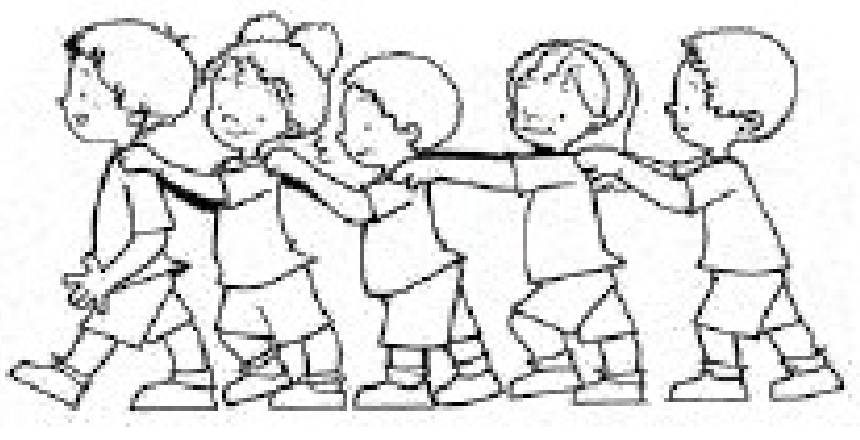

## Enunciado

Cinco amigos, Antonio, Belén, Carmen, Darío y Eugenia, se colocan en «fila india», pero tú no sabes el orden en que están colocados.

Están contando de 5 en 5: el 1.º dice 5, el 2.º dice 10, el 3.º dice 15, el 4.º dice 20, el 5.º dice 25, el 1.º sigue con 30… y siguen contando de 5 en 5. Antonio ha dicho 140; Belén, 160; Carmen, 130, y Darío, 170.

¿En qué orden se encuentran colocados los amigos en la fila? ¿Quién de ellos diría 1755?

**Razona las respuestas.**

## Solución

En cada vuelta completa se avanza 25, así que, tras $X$ vueltas, el 1.º dice $5 + 25X$, el 2.º $10 + 25X$, el 3.º $15 + 25X$, el 4.º $20 + 25X$ y el 5.º $25 + 25X$. Basta mirar el resto de dividir entre 25:

- Antonio: $140 = 5 \cdot 25 + 15$, está en el **3.er** lugar.
- Belén: $160 = 6 \cdot 25 + 10$, está en el **2.º** lugar.
- Carmen: $130 = 5 \cdot 25 + 5$, está en el **1.er** lugar.
- Darío: $170 = 6 \cdot 25 + 20$, está en el **4.º** lugar.

El orden es **Carmen, Belén, Antonio, Darío y Eugenia**.

Como $1755 = 70 \cdot 25 + 5$, el número 1755 lo dice la que está en primer lugar: **Carmen**.
