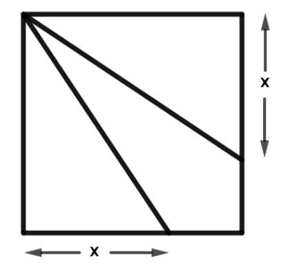
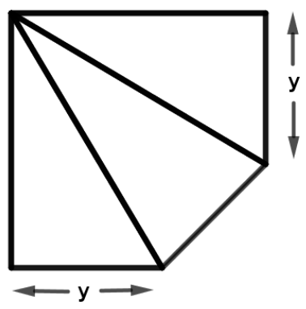

## Enunciado

Enrique es un buen matemático al que le gusta la geometría.

Quiere partir un cuadrado de lado 1 en tres partes con la misma área, como se muestra en la figura 1. ¿Qué valor debe dar a $x$ para conseguirlo?

Pero además le gusta la decoración y no encuentra elegante su construcción. Por ello decide suprimir la zona triangular inferior derecha, como indica la figura 2.

¿Podrá encontrar el valor de $y$ que haga que en este caso los tres triángulos obtenidos tengan la misma área? En caso afirmativo, calcula ese valor $y$.

**Razona tus respuestas.**

## Solución

**Figura 1.** El cuadrado tiene área 1, así que cada parte debe medir $\frac{1}{3}$. El triángulo superior tiene como base el lado de arriba (1) y como altura $x$, luego

$$\frac{1 \cdot x}{2} = \frac{1}{3} \;\Rightarrow\; x = \frac{2}{3}.$$

**Figura 2.** Llamamos $x$ a lo que falta para completar cada lado, de modo que $x + y = 1$ (1). El triángulo suprimido tiene catetos $x$ y $x$, así que la figura 2 tiene área $1 - \frac{x^2}{2}$ y cada uno de los tres triángulos debe medir

$$\frac{1 - \frac{1}{2}x^2}{3}. \quad (2)$$

Por otro lado, el triángulo superior tiene base 1 y altura $y$, y su área es $\frac{1}{2}y$ (3). Igualando (2) y (3):

$$\frac{y}{2} = \frac{1 - \frac{1}{2}x^2}{3} \;\Rightarrow\; 3y = 2 - x^2.$$

Sustituyendo $x = 1 - y$:

$$3y = 2 - (1 - y)^2 = 1 + 2y - y^2 \;\Rightarrow\; y^2 + y - 1 = 0,$$

cuyas soluciones son $y = \frac{-1 \pm \sqrt{5}}{2}$. Como $y$ es una longitud, solo vale la positiva:

$$y = \frac{-1 + \sqrt{5}}{2} \approx 0{,}618.$$

(Por simetría, el triángulo de la izquierda, de base $y$ y altura 1, tiene la misma área.)
