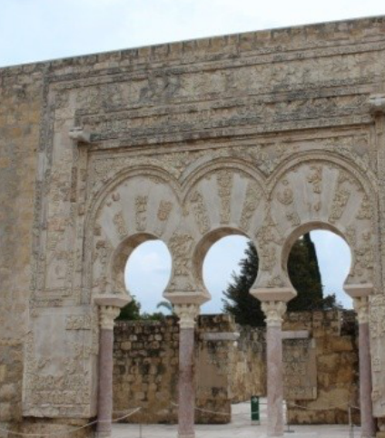

## Enunciado

Cuenta la leyenda que era tanto el amor del Califa Abderramán III hacia su amada Azahara que prometió construirle la más magnífica ciudad que los ojos hubieran visto, Medina Azahara.

Además del Califa, su hijo Alhakén II y Azahara, también vivían en la ciudad el ministro Jafar, el guardián del Salón Rico, el poeta Almutamid y el maestro alarife Abdallah.

El ministro y Azahara suman veintidós lustros, y el ministro supera a Azahara en el único primo par.

Azahara y el guardián danzan los números de sus edades cambiando estos de orden.

Tras el guardián vienen el poeta y el maestro. El primero difiere del guardián un primo impar de un solo dígito, y el otro, con dos primaveras menos, difiere un cuadrado perfecto.

El hijo del Califa dista del poeta y del maestro los mismos números que ellos distan del guardián, pero obviamente siendo bailados.

En menos de una Luna el doble de la nueva edad del hijo será la actual del Califa. ¿Cuál es la edad del Califa?

**Razona la respuesta.**

## Solución

- **Azahara y el ministro.** Suman 22 lustros, es decir, $22 \cdot 5 = 110$ años, y el ministro tiene 2 años más (el único primo par). Azahara tiene $(110 - 2) : 2 = 54$ años y el ministro, 56.
- **El guardián** tiene la edad de Azahara con las cifras cambiadas de orden: 45 años.
- **El poeta y el maestro.** Si el poeta tiene $x$ años menos que el guardián, con $x$ primo impar de una cifra (3, 5 o 7), el maestro tiene $x + 2$ años menos, y $x + 2$ ha de ser un cuadrado perfecto. De $5$, $7$ y $9$, solo $9 = 3^2$ lo es, así que $x = 7$: el poeta tiene $45 - 7 = 38$ años y el maestro, $45 - 9 = 36$.
- **El hijo del Califa** dista del poeta y del maestro las mismas cantidades, 7 y 9, pero intercambiadas: tiene 9 años menos que el poeta y 7 menos que el maestro, $38 - 9 = 36 - 7 = 29$ años.
- **El Califa.** En menos de un mes el hijo cumplirá 30 años, y el doble de esa edad es la del Califa: $2 \cdot 30 = 60$.

El Califa Abderramán III tiene **60 años**.
