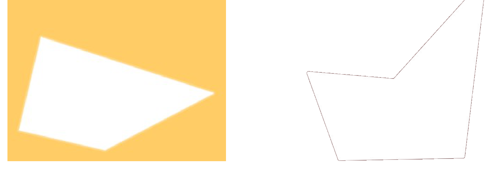
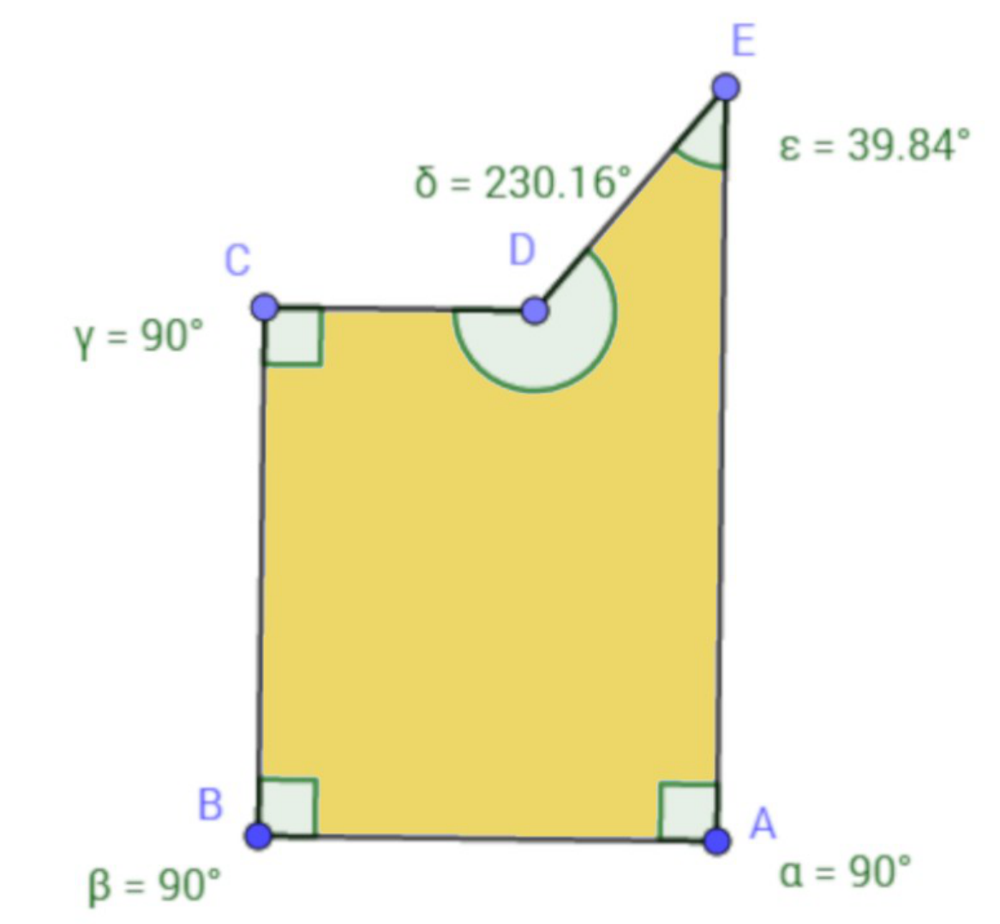

## Enunciado

Sabemos que un triángulo solo puede tener un ángulo recto, pero un cuadrilátero puede tener hasta cuatro ángulos rectos (los rectángulos).

Parece razonable que, a medida que aumenta el número de lados en los polígonos, aumente también el posible número de ángulos rectos en los mismos.

Contesta de forma razonada: ¿cuántos ángulos rectos puede llegar a tener un pentágono?

## Solución

La suma de los ángulos interiores de un polígono de $n$ lados es $180° \cdot (n - 2)$; en un pentágono, $180° \cdot 3 = 540°$.

- Con **uno, dos o tres** ángulos rectos quedan $450°$, $360°$ o $270°$ para repartir entre los otros cuatro, tres o dos ángulos, y es fácil construir ejemplos. Este pentágono tiene tres ángulos rectos (los otros dos miden $230{,}16°$ y $39{,}84°$, que suman $270°$):

- Con **cuatro** ángulos rectos, el quinto ángulo tendría que medir $540° - 360° = 180°$, que es un ángulo llano: los dos lados que lo forman están alineados y la figura es en realidad un rectángulo (cuatro lados). Dicho de otra forma, si cuatro ángulos son rectos, los lados son perpendiculares y paralelos dos a dos, y no queda sitio para un quinto vértice; para cerrar la figura haría falta un sexto lado.
- Con **cinco** ángulos rectos sumarían $450° \ne 540°$, imposible.

Un pentágono puede tener como máximo **tres ángulos rectos**.
