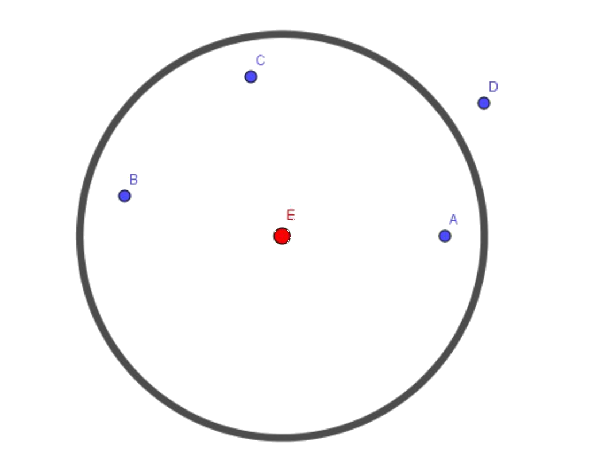

## Enunciado

Traza cada una de las siguientes circunferencias en las situaciones que te planteamos:

A) Circunferencia que pasa por dos puntos.

B) Circunferencia que pasa por tres puntos no alineados.

C) Circunferencia que está a la misma distancia de cuatro puntos.

Contesta de forma razonada: ¿cuántas circunferencias se pueden representar en cada uno de los casos anteriores?

## Solución

**A) Por dos puntos $A$ y $B$.** El centro tiene que estar a la misma distancia de $A$ y de $B$, es decir, en la mediatriz del segmento $AB$ (que se construye con el compás trazando las circunferencias de centros $A$ y $B$ y radio $AB$ y uniendo sus puntos de corte). Una de ellas es la de centro el punto medio de $AB$. Como cualquier punto de la mediatriz sirve de centro, hay **infinitas** circunferencias.

**B) Por tres puntos no alineados $A$, $B$, $C$.** El centro tiene que estar en la mediatriz de $AB$ y en la de $BC$; estas se cortan en un único punto, así que la circunferencia es **única**.

**C) A la misma distancia de cuatro puntos.** Una circunferencia equidista de los cuatro puntos cuando unos quedan dentro y otros fuera, todos a la misma distancia de ella. Hay dos tipos:

- *Tres puntos a un lado y uno al otro.* Trazamos la circunferencia que pasa por $A$, $B$ y $C$, de centro $E$, y la circunferencia de centro $E$ que pasa por $D$. La circunferencia buscada es la concéntrica que queda justo en medio de las dos (pasa por el punto medio de $A$ y del punto $F$ en que la semirrecta $EA$ corta a la otra circunferencia). Como el punto que queda solo puede ser cualquiera de los cuatro, hay **4** circunferencias de este tipo.

- *Dos puntos a cada lado.* Agrupamos los puntos por parejas, por ejemplo $\{A, D\}$ y $\{B, C\}$. El corte de las mediatrices de $AD$ y $BC$ es el centro de dos circunferencias concéntricas, una por $A$ y $D$ y otra por $B$ y $C$, y la buscada es la que queda en medio. Los cuatro puntos se pueden agrupar en parejas de 3 formas ($AD$-$BC$, $AB$-$CD$, $AC$-$BD$), así que hay **3** circunferencias de este tipo.

En total, en el caso C hay $4 + 3 = 7$ circunferencias.
