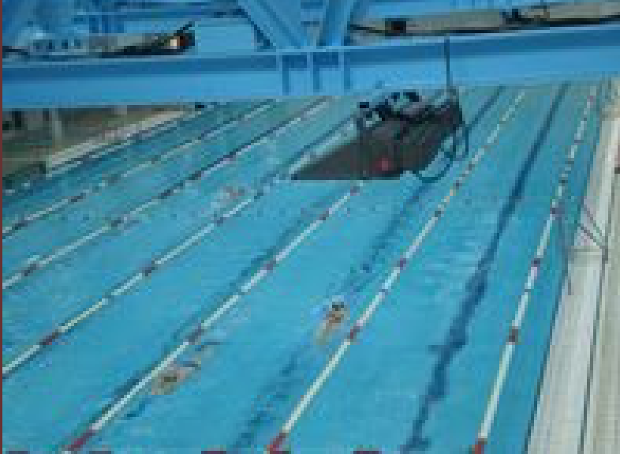

## Enunciado

Ada va a nadar a una piscina de 25 m de largo. Cuando llega a la piscina saluda de lejos a su amigo Carlos, que está haciendo una parada de 2 minutos en el lado opuesto de la piscina; él llevaba recorridos 10 largos.

A las 10:00 empiezan a nadar cada uno desde su lado de la piscina.

Ada nada 1500 m en 40 minutos y ha adelantado a Carlos 7 veces.

Si los dos terminan a la vez, responde de forma razonada: ¿qué distancia ha recorrido Carlos? ¿A qué hora empezó a nadar?

## Solución

La primera vez que Ada adelanta a Carlos es porque ha recorrido 25 m más que él, ya que salieron de lados opuestos de la piscina; cada una de las siguientes veces ha recorrido 50 m más (un largo de ida y otro de vuelta). En total, en los 40 minutos Ada ha nadado

$$25 + 6 \cdot 50 = 325 \text{ m}$$

más que Carlos. Desde las 10:00 Carlos ha nadado $1500 - 325 = 1175$ m, y como ya llevaba 10 largos ($250$ m), **en total ha recorrido 1425 m**.

Su velocidad es $1175 : 40 = 29{,}375$ m/min, así que los 250 m iniciales le llevaron $250 : 29{,}375 \approx 8{,}5$ minutos. Sumando los 2 minutos de descanso, empezó unos $10{,}5$ minutos antes de las 10:00, es decir, **a las 9:49:30** aproximadamente.
