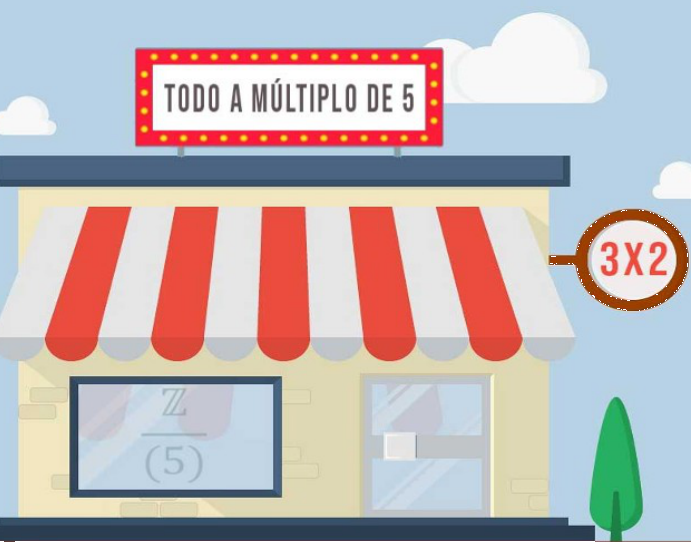

## Enunciado

¡Qué tienda más curiosa! Todos los precios de los artículos son múltiplos de 5. Además, durante esta semana hay una oferta de 3x2 (te llevas tres artículos pagando dos, obviamente los dos de más valor en caso de no ser iguales). Se sabe que no se acumulan promociones.

En la cola de la caja, una clienta tiene una tarjeta descuento del 30 % y quiere utilizarla. Viendo su mercancía, le aconsejo que se acoja a la oferta de esta semana y guarde la tarjeta descuento para otra ocasión.

¿Cuáles son todos los posibles precios de los 3 artículos elegidos por la clienta, sabiendo que pagó menos de 60 € en su ticket de compra?

**Razona las respuestas.**

## Solución

Sean $a \ge b \ge c$ los precios (en euros, múltiplos de 5). Con la oferta paga $a + b$, y con la tarjeta, el 70 % del total, $0{,}7\,(a + b + c)$. Mi consejo es bueno si

$$a + b \le 0{,}7\,(a + b + c) \iff 3\,(a + b) \le 7c,$$

y además $a + b < 60$, es decir, $a + b \le 55$. Estudiamos los casos:

- **Tres precios iguales** ($a = b = c$): $6c \le 7c$ siempre se cumple. Con $2c \le 55$: **5-5-5, 10-10-10, 15-15-15, 20-20-20 y 25-25-25**.
- **Dos iguales y el tercero más barato** ($a = b > c$): necesitamos $6a \le 7c$, con $c \le a - 5$, es decir, $6a \le 7a - 35$, $a \ge 35$; pero entonces $a + b \ge 70$. Ninguno. (Por ejemplo, 25-25-20: oferta 50 €, tarjeta 49 €.)
- **Dos iguales y el tercero más caro** ($a > b = c$): necesitamos $3a \le 4b$. Con $a = b + 5$ queda $b \ge 15$: 20-15-15 (35 € de las dos formas), **25-20-20** (45 € frente a 45,50 €) y **30-25-25** (55 € frente a 56 €). Con $a = b + 10$ haría falta $b \ge 30$ y ya se pasa de 55 €.
- **Tres precios distintos** ($a > b > c$): $c \le b - 5$ y $a \ge b + 5$ dan $3(2b + 5) \le 3(a + b) \le 7c \le 7b - 35$, es decir, $b \ge 50$, imposible. (Por ejemplo, 30-25-20: oferta 55 €, tarjeta 52,50 €.)

Los posibles precios son **5-5-5, 10-10-10, 15-15-15, 20-20-20, 25-25-25, 25-20-20 y 30-25-25**, y también **20-15-15** si, como el pago es el mismo (35 €), se prefiere guardar la tarjeta para otra ocasión.
