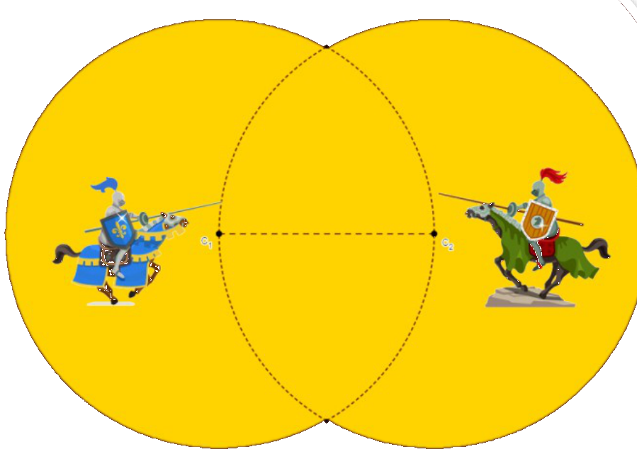

## Enunciado

La grabación de la batalla final de la serie de éxito *Juego de Mates* va a ser grabada en Ciudad Épsilon, en Matelandia. Dicha batalla, que enfrentará a los habitantes de Geometralia y Derivando del Rey, transcurrirá en un coso como el que muestra la figura, formado por dos círculos superpuestos de radio 136,64 metros.

a) ¿Cuál es el perímetro del recinto de la batalla final?

b) ¿Qué porcentaje del área del círculo de la izquierda es solapada por el círculo de la derecha?

**Razona las respuestas.**

## Solución

Sea $r = 136{,}64$ m. El centro de cada círculo está en la circunferencia del otro, así que los dos centros y cada uno de los dos puntos de corte forman triángulos equiláteros de lado $r$.

a) Cada punto de corte forma con los dos centros un triángulo equilátero, de modo que el arco común de cada círculo (el que queda dentro del otro) abarca $2 \cdot 60° = 120°$ y el arco exterior, $240°$. El perímetro está formado por dos arcos de $240°$, es decir, por ocho arcos de $60°$, que son $\frac{8}{6}$ de una circunferencia:

$$P = \frac{8}{6} \cdot 2\pi r = \frac{8}{6} \cdot 2 \cdot 3{,}14 \cdot 136{,}64 \approx 1144{,}71 \text{ m}.$$

b) La zona solapada se descompone en los dos triángulos equiláteros de lado $r$ y cuatro segmentos circulares de $60°$.

- Altura del triángulo, por Pitágoras: $h = \sqrt{r^2 - (r/2)^2} = \frac{\sqrt{3}}{2}\,r \approx 118{,}33$ m, y su área, $\frac{r \cdot h}{2} \approx 8084{,}5$ m².
- Cada segmento circular es un sector de $60°$ menos el triángulo: $\frac{\pi r^2}{6} - 8084{,}5 \approx 9775{,}9 - 8084{,}5 = 1691{,}4$ m².

El área solapada es $2 \cdot 8084{,}5 + 4 \cdot 1691{,}4 \approx 22\,934$ m², y el círculo mide $\pi r^2 \approx 58\,655$ m², así que la parte solapada es

$$\frac{22\,934}{58\,655} \approx 0{,}391,$$

es decir, el **39,10 %** del círculo.

(En general, la fracción es $\frac{2}{3} - \frac{\sqrt{3}}{2\pi}$, que no depende del radio.)
