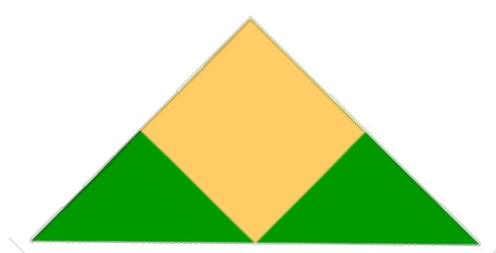
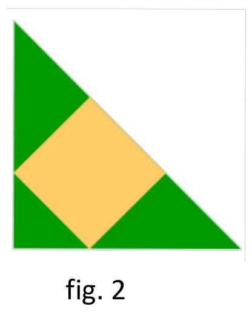
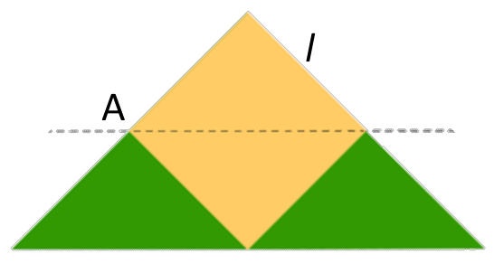
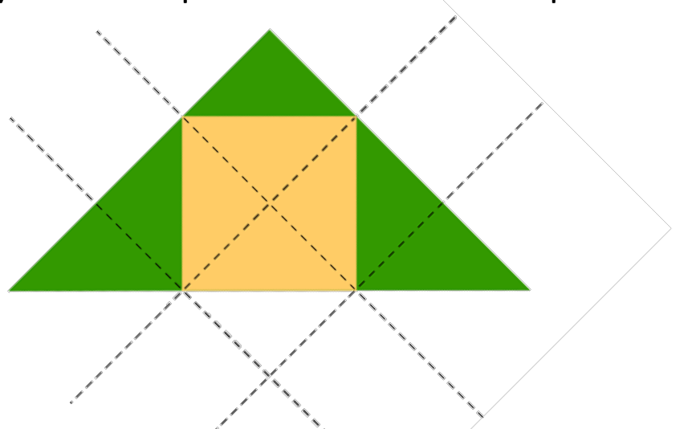

## Enunciado

El periodo de confinamiento nos ha hecho valorar la importancia de tener la mayor extensión posible de jardín en nuestras viviendas. Tenemos una parcela con forma de triángulo rectángulo isósceles que ocupa una extensión de 882 m² y queremos construir una casa de planta cuadrada tal y como nos indica la figura 1.

a) ¿Qué superficie de jardín podemos tener?

b) ¿Cuál sería el perímetro de la vivienda?

Y si la planta de la vivienda se situase como en la figura 2:

c) ¿Qué superficie de jardín podemos tener?

d) ¿Qué superficie ocupará la vivienda?

**Explica el procedimiento que has seguido para resolver las cuestiones.**

## Solución

a) Trazando por el vértice A del cuadrado una paralela a la hipotenusa, la vivienda queda dividida en dos triángulos iguales a los dos triángulos del jardín:

Así, la vivienda y el jardín ocupan la mitad de la parcela cada uno: el jardín mide $\frac{882}{2} =$ **441 m²**.

b) La vivienda es un cuadrado de área $l^2 = 441$, luego $l = \sqrt{441} = 21$ m y su perímetro es $4 \cdot 21 =$ **84 m**.

c) Girando la figura 2 y trazando paralelas a los catetos por los vértices del cuadrado, la parcela queda dividida en nueve triángulos iguales; la vivienda ocupa cuatro y el jardín cinco:

El jardín mide $\frac{5}{9} \cdot 882 =$ **490 m²**.

d) La vivienda ocupa $\frac{4}{9} \cdot 882 =$ **392 m²**.
