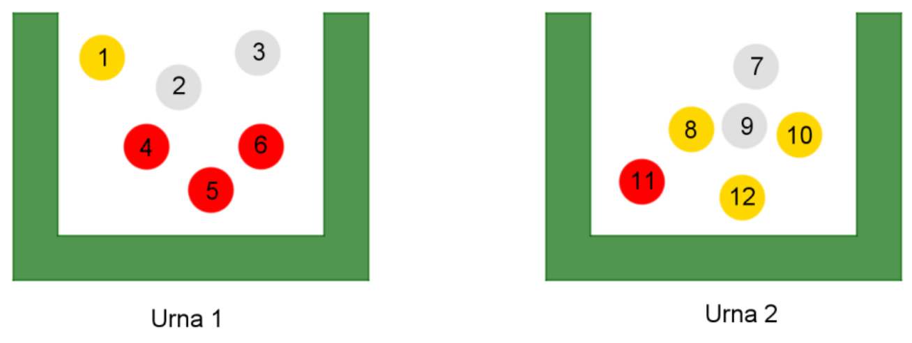

## Enunciado

En el mercadillo de Navidad de Chiclana de la Frontera este año ha llegado un puesto en el que se propone un juego. El puesto dispone de dos urnas cerradas, en las que no se puede ver lo que hay dentro, y de 12 bolas del mismo tamaño: cuatro doradas, cuatro plateadas y cuatro rojas.

Lola, la señora que dirige el puesto, mete las bolas en las urnas de la siguiente manera: una bola dorada en la primera urna y las otras tres en la segunda; dos bolas plateadas en la primera y las otras dos en la segunda; y tres bolas rojas en la primera y la otra en la segunda.

Nos plantea el siguiente juego: «Vais a sacar una bola sin mirar de cada una de las urnas. Si son de distinto color, se devuelven a sus urnas, y si son del mismo color, se gana el juego».

**Primera cuestión.** ¿A qué color jugaríais para tener más opciones de ganar?

1. Jugaría a dos bolas doradas.
2. Jugaría a dos bolas plateadas.
3. Da igual jugar a cualquier color, ya que hay cuatro bolas de cada color.
4. Jugaría a dos bolas rojas.

**Segunda cuestión.** Si alguien apuesta por las bolas doradas, Lola le plantea: si quitamos una bola dorada de la segunda urna, ¿seguirías apostando por las dos bolas doradas?

1. Sí, claro, seguiría jugando a dos bolas doradas.
2. En este caso daría igual jugar a bolas doradas o plateadas.
3. No; al haber menos bolas doradas, apostaría por bolas plateadas.
4. Entonces apostaría por bolas rojas, que hay más en la primera urna.

**Tercera cuestión.** Si alguien apuesta por las bolas plateadas, Lola le plantea: si pasamos una bola plateada de la primera urna a la segunda, ¿seguirías apostando por las dos bolas plateadas?

1. En realidad dejaría de apostar a plateadas y apostaría por bolas doradas.
2. Mantendría mi apuesta, seguiría jugando a bolas plateadas.
3. No, pasaría a apostar por bolas rojas o plateadas.
4. Ahora me daría igual apostar a cualquier color.

**Cuarta cuestión.** Si alguien apuesta por las bolas rojas, Lola, que no se queda satisfecha con esa elección, le dice: «¿Estás segura? Creo que, si mueves una bola de lugar, podrás tener más opciones con tu bola roja». ¿Qué bola moverías y hacia dónde?

1. Movería una bola roja de la primera a la segunda urna.
2. Lola no tiene razón: no movería nada, las bolas rojas ya tienen la máxima opción de ganar.
3. Movería una bola plateada de la segunda a la primera urna.
4. Movería una bola roja de la segunda a la primera urna.

## Solución

Numeramos las bolas: en la urna 1 están la dorada 1, las plateadas 2 y 3 y las rojas 4, 5 y 6; en la urna 2, las plateadas 7 y 9, las doradas 8, 10 y 12 y la roja 11.

Contamos las parejas (una bola de cada urna) del mismo color.

**Primera cuestión.** Doradas: (1, 8), (1, 10), (1, 12): 3. Plateadas: (2, 7), (2, 9), (3, 7), (3, 9): 4. Rojas: (4, 11), (5, 11), (6, 11): 3. La mejor opción es la **2: dos bolas plateadas**.

**Segunda cuestión.** Quitando la dorada 12 quedan 2 parejas doradas, 4 plateadas y 3 rojas: la respuesta es la **3, apostar por plateadas**.

**Tercera cuestión.** Pasando la plateada 2 a la segunda urna, las plateadas son (3, 2), (3, 7), (3, 9): 3, igual que las doradas y las rojas. La respuesta es la **4: da igual el color**.

**Cuarta cuestión.** Lo mejor es equilibrar las bolas rojas, dos en cada urna: así pasan de 3 a $2 \cdot 2 = 4$ parejas. La respuesta es la **1: mover una bola roja de la primera a la segunda urna**.
