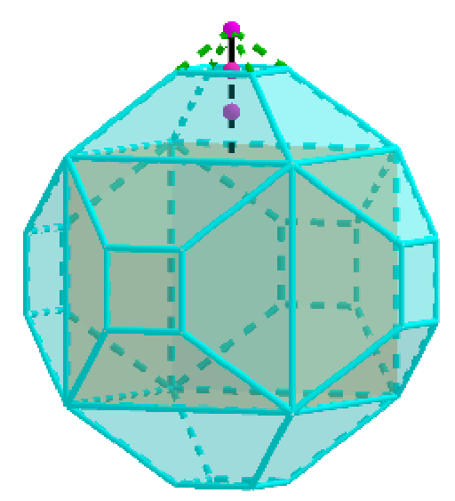
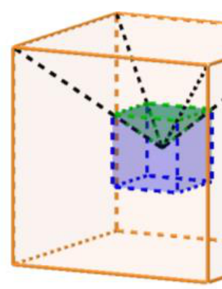

## Enunciado

Una empresa ha diseñado unas lámparas con forma poliédrica como la de la imagen. Se han formado de la siguiente manera: sobre cada una de las caras de un cubo se ha levantado una pirámide de altura igual a la distancia de cada cara al centro del cubo, y luego estas se han truncado, formando troncos de pirámide de altura $\frac{2}{3}$ de la pirámide original.

Si el cubo tiene una capacidad de 54 litros, ¿cuál es la capacidad de la lámpara completa?

**Razona la respuesta.**

## Solución

**Primera forma.** Si no se hubieran truncado las pirámides, las seis pirámides juntas tendrían el mismo volumen que el cubo (cada una es la sexta parte de un cubo igual, con vértice en su centro), así que la figura completa tendría el doble de capacidad que el cubo.

Los seis picos que se quitan son pirámides semejantes de razón $\frac{1}{3}$, y juntos forman un cubo de arista la tercera parte de la original:

Ese cubito cabe 27 veces en el cubo grande, así que los seis picos tienen $54 : 27 = 2$ litros. La capacidad de la lámpara es

$$2 \cdot 54 - 2 = \mathbf{106\ litros}.$$

**Segunda forma.** La arista del cubo es $a = \sqrt[3]{54} = 3\sqrt[3]{2}$ dm. Cada pirámide completa tiene base $a^2$ y altura $\frac{a}{2}$, con volumen $\frac{a^2 \cdot a/2}{3} = \frac{a^3}{6} = 9\ \text{dm}^3$. La pirámide que se quita tiene arista y altura $\frac{1}{3}$ de las anteriores, así que su volumen es $\frac{9}{27} = \frac{1}{3}\ \text{dm}^3$. Cada tronco mide $9 - \frac{1}{3} = \frac{26}{3}$ litros, y la lámpara

$$54 + 6 \cdot \frac{26}{3} = 54 + 52 = 106\ \text{litros}.$$
