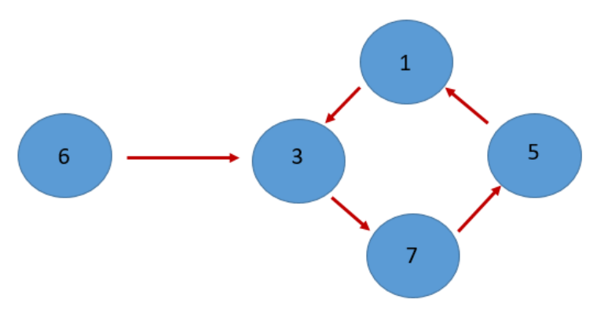

## Enunciado

Partiendo de un número entero entre 0 y 9, nos interesan las sucesivas transformaciones que sufre al aplicarle una función, manteniendo solo el dígito de las unidades cada vez. Por ejemplo, si consideramos la función $f(x) = 2x + 1$ y partimos del entero 6, obtenemos sucesivamente:

- $2 \times 6 + 1 = 13$: nos quedamos con la cifra de las unidades, 3;
- $2 \times 3 + 1 = 7$: nos quedamos con 7;
- $2 \times 7 + 1 = 15$: nos quedamos con 5;
- $2 \times 5 + 1 = 11$: nos quedamos con 1;
- $2 \times 1 + 1 = 3$: nos quedamos con 3;
- $2 \times 3 + 1 = 7$, y así sucesivamente…

Podríamos continuar indefinidamente, pero vemos que el proceso ha cerrado el círculo.

Llamaremos **órbita** de un entero entre 0 y 9, bajo la acción de la función $f$, a la secuencia de enteros sucesivos obtenidos aplicando $f$ y manteniendo solo el dígito de las unidades. En el ejemplo anterior, la órbita de 6 es $(6, 3, 7, 5, 1, 3, 7, 5, 1, 3, \dots)$, que se descompone en dos fases: una primera secuencia transitoria $(6, 3)$ y otra secuencia que se repite indefinidamente $(3, 7, 5, 1, \dots)$. Una secuencia como esta la denominamos **ciclo**, y al número de enteros que contiene (en este caso, 4) se le denomina **longitud del ciclo**.

Como ayuda te presentamos el gráfico de la órbita del número 6 para la función $f(x) = 2x + 1$:

**Contesta razonadamente las siguientes cuestiones:**

a) Para la función $f(x) = 4x + 1$:

1. Determina la órbita y la longitud del ciclo para el número 2, y represéntala con un diagrama como el de la órbita de 6.
2. Determina la órbita y la longitud de su ciclo, y represéntala con un diagrama, para los números enteros 0, 3, 4, 6 y 8.

b) Explica brevemente por qué la órbita de un número entero siempre termina recorriendo un ciclo, independientemente de la función aplicada.

## Solución

a) Con $f(x) = 4x + 1$, quedándonos con las unidades:

| Número | Órbita | Ciclo | Longitud |
|---|---|---|---|
| 2 | 2 → 9 → 7 → 9 → 7 … | (9, 7) | 2 |
| 0 | 0 → 1 → 5 → 1 → 5 … | (1, 5) | 2 |
| 3 | 3 → 3 … | (3) | 1 |
| 4 | 4 → 7 → 9 → 7 → 9 … | (7, 9) | 2 |
| 6 | 6 → 5 → 1 → 5 → 1 … | (5, 1) | 2 |
| 8 | 8 → 3 → 3 … | (3) | 1 |

(Por ejemplo, para el 2: $4 \cdot 2 + 1 = 9$; $4 \cdot 9 + 1 = 37 \to 7$; $4 \cdot 7 + 1 = 29 \to 9$…)

b) La cifra de las unidades solo puede tomar diez valores (del 0 al 9) y, como $f$ es una función, cada cifra lleva siempre a la misma cifra siguiente. Al ir aplicando $f$, antes o después (como mucho tras diez pasos) aparecerá una cifra que ya había salido. A partir de ese momento la secuencia repite exactamente los mismos valores que la primera vez, es decir, entra en un ciclo.
