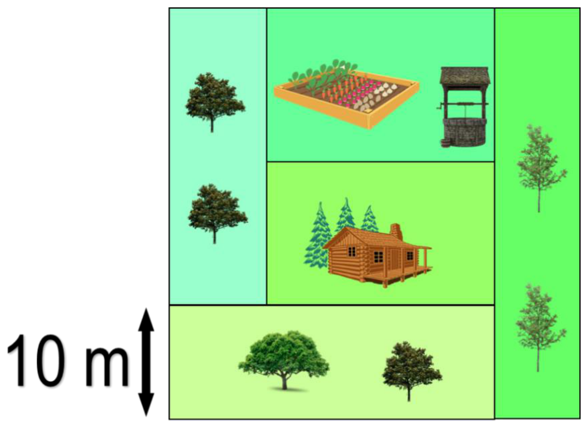
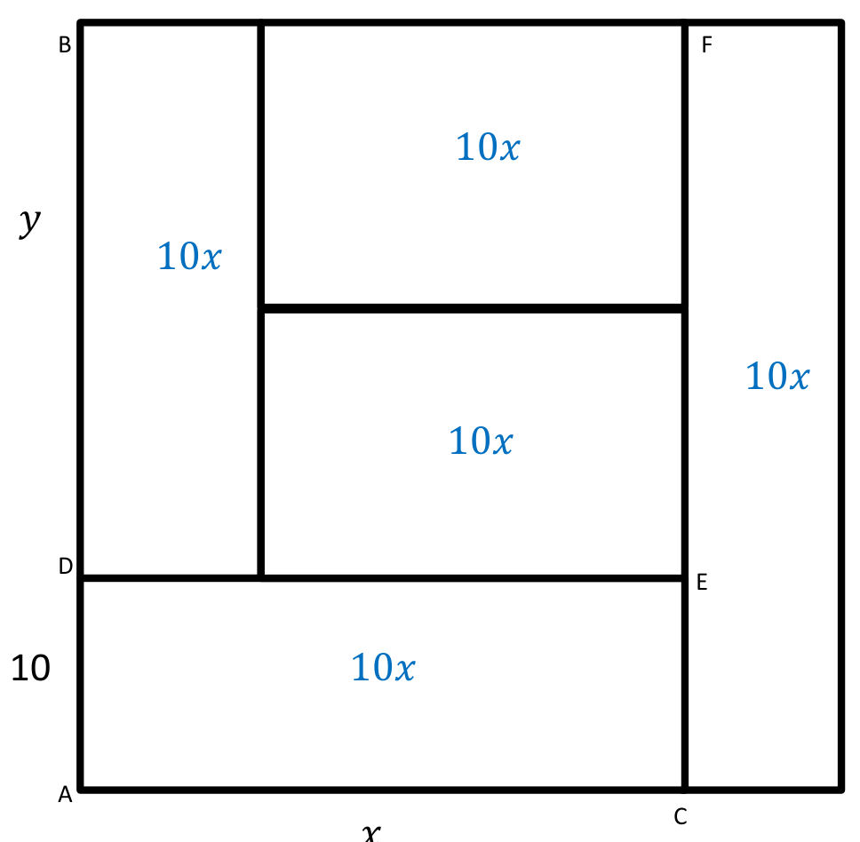

## Enunciado

Un padre ha dado como herencia a sus cinco hijos e hijas una finca cuadrada como indica la figura. Cada una de las cinco partes en las que se ha dividido tiene la misma área que las demás. Usando la medida que aparece en el dibujo, halla la superficie de toda la finca.

**Razona tu respuesta.**

## Solución

Llamamos $x$ a la base del rectángulo de abajo ($AC$) e $y$ a la altura del resto ($BD$):

El rectángulo de abajo tiene área $10x$, así que los cinco tienen área $10x$. El rectángulo $BDEF$, de base $x$ y altura $y$, está formado por tres de ellos:

$$x \cdot y = 10x + 10x + 10x = 30x \;\Rightarrow\; y = 30\ \text{m}.$$

El lado de la finca mide $10 + 30 = 40$ m, y su superficie es $40^2 =$ **1600 m²**.
