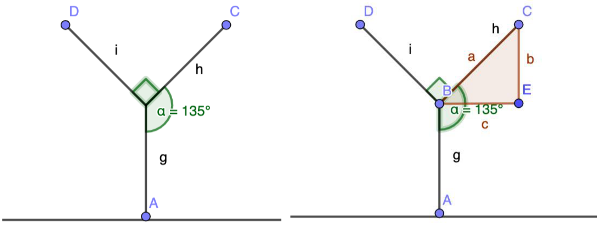
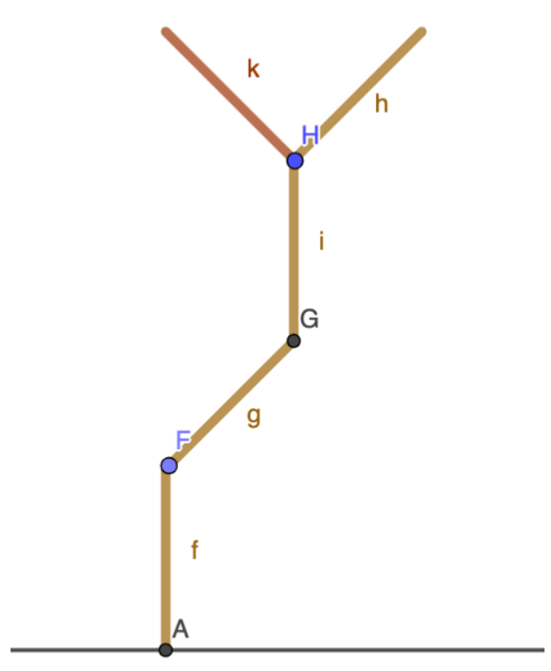

## Enunciado

Este año 2021, para celebrar esta olimpiada tan atípica, el 1 de enero hemos plantado la semilla de una enredadera de crecimiento secuencial en la fachada del edificio de mi casa, que tiene 5 plantas de altura y cada una mide 2,80 metros.

Sabemos que durante el primer año crece una rama perpendicular al suelo que alcanzará la longitud de 8 cm el 31 de diciembre.

Durante el segundo año, 2022, le crecen dos ramas de 8 cm cada una, que forman entre sí 90° y un ángulo de 135° con la rama madre.

A lo largo del tercer año, 2023, a la rama de la derecha le crecen dos ramas de 8 cm cada una, que forman entre sí un ángulo de 90° y de 135° con la rama madre. La rama de la izquierda se seca y cae.

En el cuarto año, 2024, el crecimiento es simétrico: crece según el patrón anterior la rama de la izquierda, y se seca y cae la de la derecha.

Y así sucesivamente, siguiendo la secuencia de los dos últimos años.

**Contesta razonadamente las siguientes cuestiones:**

a) Razona si la siguiente afirmación es cierta o falsa: «En el año 2050 crecerá la rama de la derecha y se secará y caerá la rama de la izquierda».

b) ¿Qué longitud de ramas tendrá la enredadera el 31 de diciembre del año 2050? (224 cm, 232 cm, 240 cm, 248 cm o 256 cm)

c) ¿A qué altura llegará en el año 2050?

d) ¿Cuál es la fórmula que nos da la altura de la enredadera en función de los años que lleva plantada?

e) ¿En qué año superará por primera vez la altura del edificio?

## Solución

a) En 2023 crece la derecha y cae la izquierda; en 2024, al revés, y así sucesivamente: en los años impares crece la rama de la derecha. 2050 es par, así que la afirmación es **falsa**.

b) De 2021 a 2050 hay 30 años. En 29 de ellos queda una rama de 8 cm, y en el último hay dos ramas nuevas de 8 cm: en total $31 \cdot 8 =$ **248 cm**.

c) El primer año la rama es vertical: la altura es 8 cm. El segundo año las ramas forman 45° con la horizontal; por Pitágoras, cada rama de 8 cm sube $\frac{8}{\sqrt{2}} = 4\sqrt{2}$ cm:

En 2023 crece una rama vertical (8 cm más) y en 2024 otra vez dos ramas inclinadas ($4\sqrt{2}$ cm más):

$$a_{2021} = 8, \quad a_{2022} = 8 + 4\sqrt{2}, \quad a_{2023} = 16 + 4\sqrt{2}, \quad a_{2024} = 16 + 8\sqrt{2}, \dots$$

Cada dos años sube $8 + 4\sqrt{2}$ cm. En 30 años:

$$15\,(8 + 4\sqrt{2}) = 120 + 60\sqrt{2} \approx \mathbf{204{,}85\ cm}.$$

d) Si $n$ es el número de años transcurridos:

- $n$ par: $\;(8 + 4\sqrt{2}) \cdot \dfrac{n}{2}$ cm.
- $n$ impar: $\;(8 + 4\sqrt{2}) \cdot \dfrac{n - 1}{2} + 8$ cm.

(También se puede escribir como la recurrencia $a_{n+3} = a_{n+2} + a_{n+1} - a_n$ con $a_0 = 0$, $a_1 = 8$, $a_2 = 8 + 4\sqrt{2}$.)

e) El edificio mide $5 \cdot 280 = 1400$ cm. Cada dos años la enredadera sube $8 + 4\sqrt{2} \approx 13{,}66$ cm, y $1400 : 13{,}66 \approx 102{,}5$. Tras 102 periodos de dos años (204 años) mide unos 1393 cm, y el año siguiente sube 8 cm más y supera los 1400 cm: lo superará en el año **2225**.
