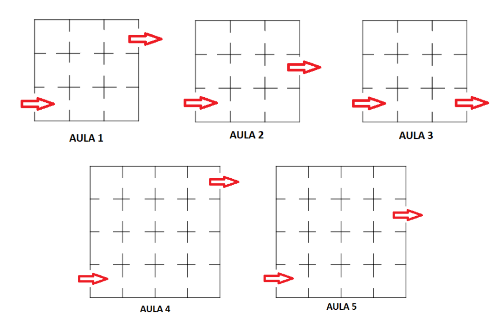
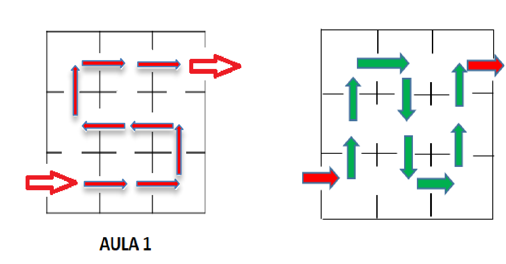
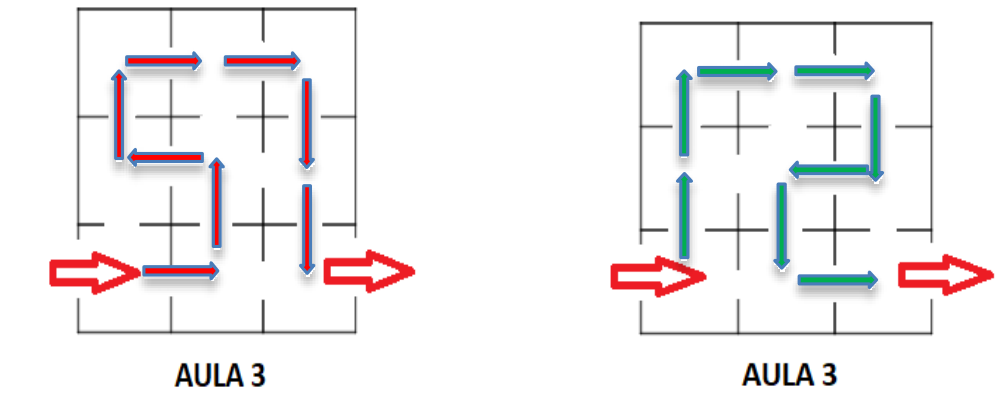

## Enunciado

Cinco aulas del IES de Ángel están divididas en compartimentos como se muestra en las figuras adjuntas. Ángel le propone a su hermano Jaime un reto: debe pasar por todos los compartimentos del aula en una sola visita, sin volver a cruzar por los que ya ha pasado, empezando por la flecha de entrada y terminando en la flecha de salida.

Dibuja aquellas opciones donde sea posible recorrerlos con las condiciones anteriores.

## Solución

La situación se puede modelizar con la teoría de grafos, como el célebre problema de los siete puentes de Königsberg, que Euler resolvió en 1736 dando origen a esa teoría: los compartimentos son los vértices y las puertas entre ellos, las aristas.

**Aula 1.** Es posible, y de varias formas; por ejemplo:

**Aula 2.** Es **imposible**: cualquier intento, o bien deja un compartimento sin visitar, o bien pasa dos veces por el mismo.

**Aula 3.** Es posible, también de varias formas:

**Aula 4.** Es **imposible**, por el mismo motivo que el aula 2.

**Aula 5.** Sí es posible: se entra por la fila de abajo, se recorre de izquierda a derecha y se va subiendo en zigzag por las filas hasta llegar a la salida.

¿Hay alguna otra posibilidad en las aulas 1, 3 y 5?
