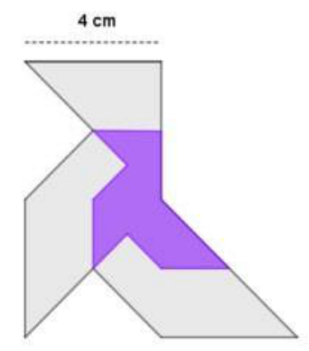

## Enunciado

En clase de matemáticas hemos hecho papiroflexia y la profesora nos ha dado folios de distinto tamaño. A mi amiga Elena y a mí nos han quedado estas dos pajaritas semejantes:

Calcula el área de la pajarita pequeña.

Si el perímetro de la pequeña es de 18 cm, ¿cuál es el perímetro de la pajarita grande?

**Razona todas tus respuestas.**

## Solución

Por construcción, la razón de semejanza entre la pajarita pequeña y la grande es $\frac{1}{2}$.

a) La razón entre las áreas de dos polígonos semejantes es el cuadrado de la razón de semejanza, $\frac{1}{4}$. El área de la pajarita grande se puede hallar dividiéndola en figuras conocidas, o «rellenando cuadrados»: equivale a un rectángulo de $4 \times 8 = 32\ \text{cm}^2$. Por tanto, la pajarita pequeña mide $32 \cdot \frac{1}{4} =$ **8 cm²**.

b) La razón entre los perímetros es la razón de semejanza, así que el perímetro de la grande es $18 \cdot 2 =$ **36 cm**.
