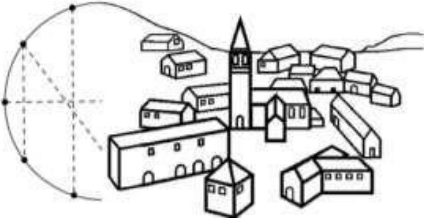
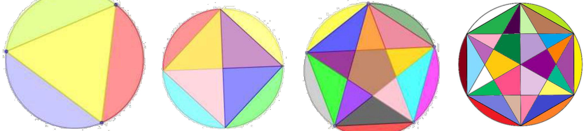

## Enunciado

A un experto jardinero se le ha pedido que presente cuatro diseños diferentes para la decoración de una plaza circular, cumpliendo la siguiente condición: en cada diseño deberá marcar 3, 4, 5 y 6 puntos respectivamente, igualmente espaciados sobre el borde de la plaza. Uniendo cada punto con los restantes, la plaza quedará dividida en distintas regiones. Cada una de estas regiones se decorará con flores diferentes propias de la zona.

Realiza un boceto de cómo serían los cuatro proyectos que el jardinero presentaría e indica el número de variedades de flores que necesitaría en cada uno de ellos.

Después de estudiar los proyectos presentados se decide elegir el que utiliza cuatro puntos. Teniendo en cuenta que la plaza tiene un diámetro de 100 m, **contesta de forma razonada**: ¿qué superficie se plantaría de cada una de las variedades que se necesitan?

## Solución

Los cuatro bocetos (3, 4, 5 y 6 puntos):

- **3 puntos** (sectores de 120°): 4 regiones, 4 variedades de flores.
- **4 puntos** (sectores de 90°): 8 regiones, 8 variedades.
- **5 puntos** (sectores de 72°): 16 regiones, 16 variedades.
- **6 puntos** (sectores de 60°): 30 regiones, 30 variedades.

En el diseño de 4 puntos, las dos diagonales del cuadrado inscrito dividen la plaza en 4 triángulos rectángulos isósceles y 4 segmentos circulares. El radio es 50 m.

Cada triángulo tiene catetos de 50 m: $S = \dfrac{50 \cdot 50}{2} = 1250\ \text{m}^2$.

El círculo mide $\pi \cdot 50^2 = 2500\pi \approx 7853{,}98\ \text{m}^2$; quitando los cuatro triángulos quedan $7853{,}98 - 4 \cdot 1250 = 2853{,}98\ \text{m}^2$, y cada segmento circular mide $2853{,}98 : 4 \approx 713{,}50\ \text{m}^2$.

Hay **cuatro variedades de 1250 m²** cada una y **otras cuatro de unos 713,50 m²** cada una.
