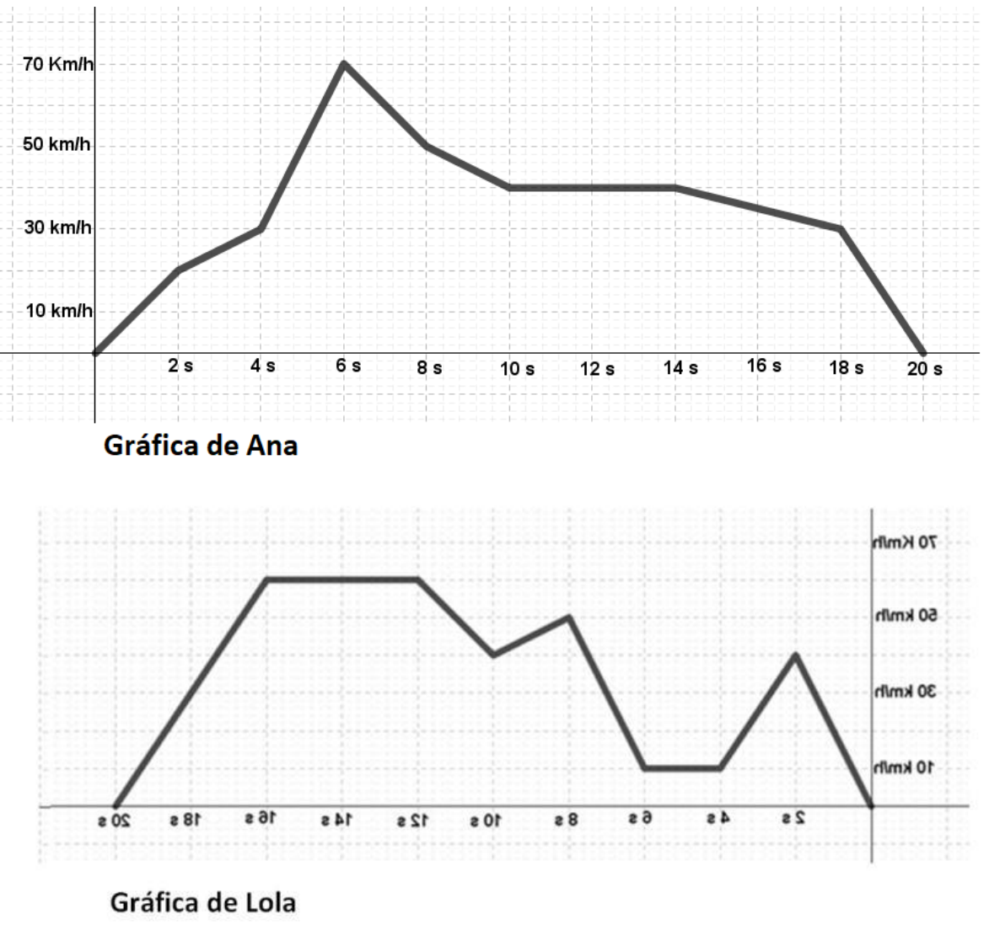
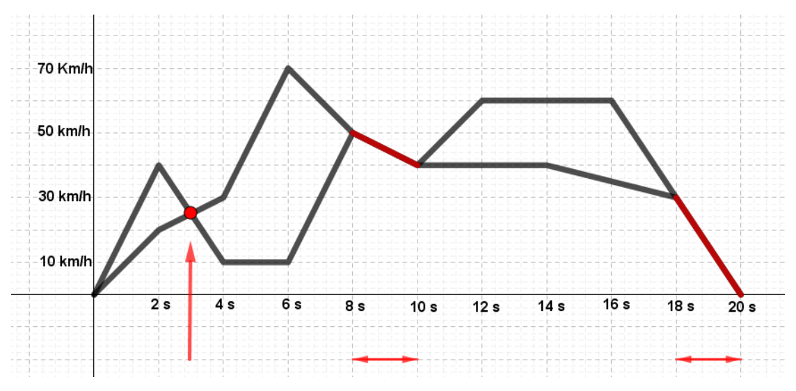

## Enunciado

Dos amigas, Ana y Lola, están jugando a un videojuego en el que van a conducir una moto cada una. El juego consiste en recorrer parte de un circuito y parar a los 20 segundos. Tras haber completado los 20 segundos, estas son las gráficas de las velocidades empleadas por cada una de ellas:

Teniendo en cuenta que la gráfica de Lola está vista en un espejo, contesta a las siguientes preguntas:

a) ¿Cuál de ellas estuvo más tiempo aumentando la velocidad?

b) ¿En qué momentos circularon ambas a la misma velocidad?

c) ¿Quién mantuvo más tiempo la velocidad constante?

**Razona todas tus respuestas.**

## Solución

Primero hay que reflejar la gráfica de Lola para que el tiempo avance de izquierda a derecha (lo que en la gráfica reflejada es creciente, en la real es decreciente).

a) Ana aumenta la velocidad durante 6 segundos (de 0 a 6 s), y Lola durante $2 + 2 + 2 = 6$ segundos. **Las dos aumentan la velocidad el mismo tiempo**, 6 segundos.

b) Superponiendo las dos gráficas:

Circularon a la misma velocidad **en el instante inicial, a los 3 segundos, entre los 8 y los 10 segundos y entre los 18 y los 20 segundos**.

c) Ana mantuvo la velocidad constante 4 segundos (de 10 a 14 s); Lola, $2 + 4 = 6$ segundos. **Lola** mantuvo más tiempo la velocidad constante.
