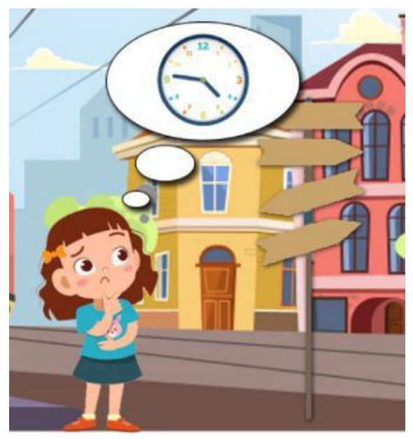
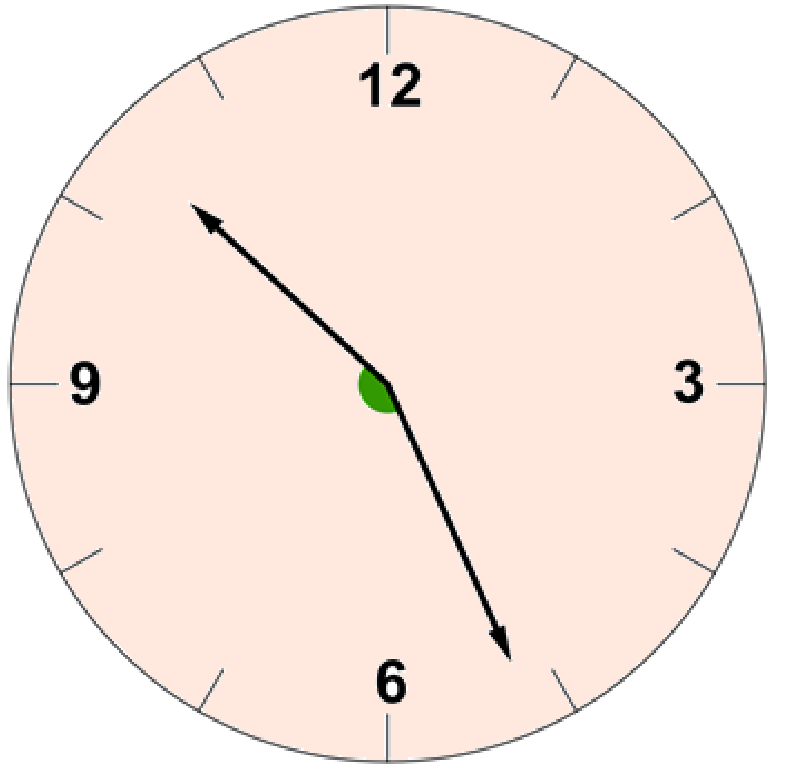

## Enunciado

A la clase de María ha llegado un nuevo compañero, Rubén, que es un apasionado de las matemáticas y a todo responde con acertijos. Hoy van a realizar un trabajo que deberán hacer de forma cooperativa y, para empezar, María le ha preguntado a Rubén cuál es su dirección. Rubén le ha respondido: «Vivo en la calle Thales y el número coincide con el menor ángulo que forman las agujas del reloj cuando son las 10:26».

Al cabo de unos minutos María descubre adónde tiene que ir. ¿Cuál es la dirección completa de Rubén?

**Razona tu respuesta.**

## Solución

- La aguja horaria se mueve $360° : 12 = 30°$ cada 60 minutos, es decir, $0{,}5°$ por minuto.
- El minutero se mueve $360°$ cada 60 minutos, es decir, $6°$ por minuto.

Dividimos el ángulo en tres partes:

- Del minutero (minuto 26) al 6 (minuto 30): $4 \cdot 6° = 24°$.
- Del 6 al 10: $4 \cdot 30° = 120°$.
- Del 10 a la aguja horaria, que ha avanzado 26 minutos: $26 \cdot 0{,}5° = 13°$.

En total, $24° + 120° + 13° = 157°$. Rubén vive en el **número 157 de la calle Thales**.
