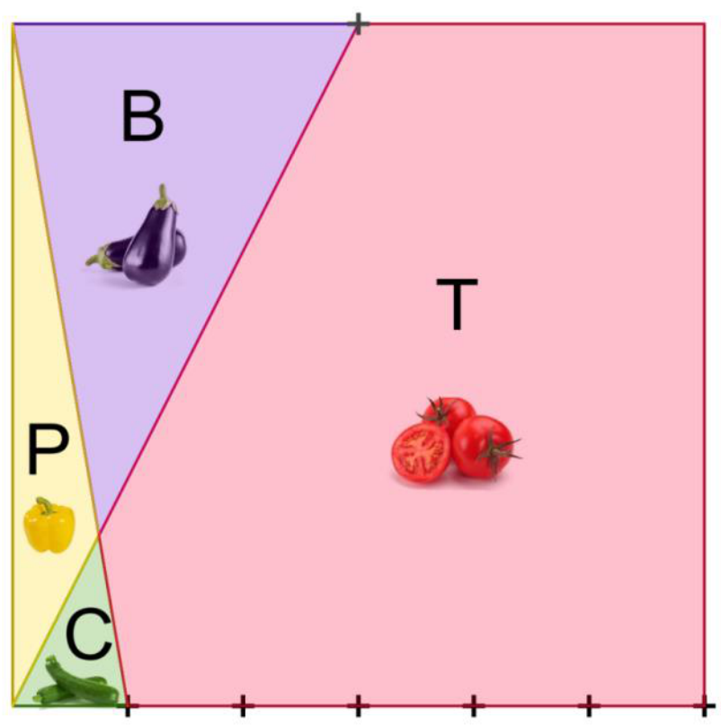
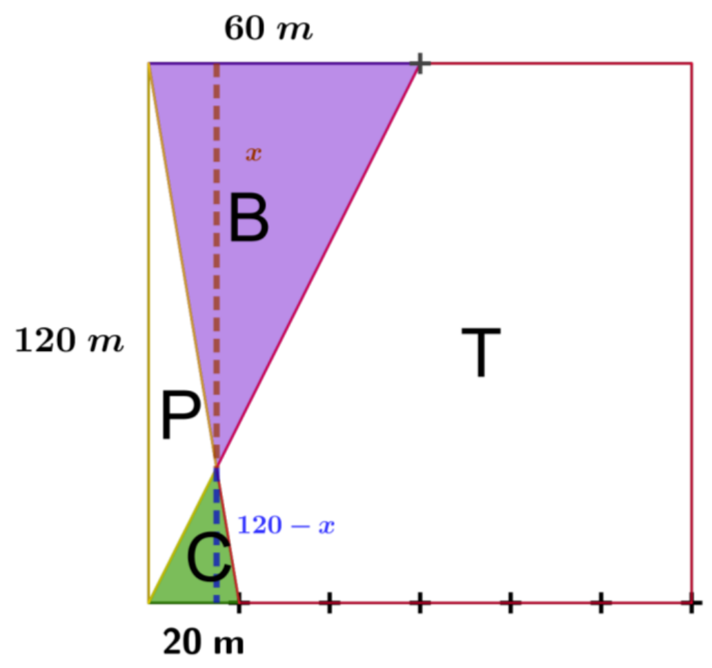

## Enunciado

Alejandro ha construido un invernadero de forma cuadrada con una superficie de 1,44 ha, donde desea cultivar pimientos, berenjenas, calabacines y tomates. Para ello lo ha dividido en cuatro zonas o parcelas, como se observa en la figura.

**Calcula de forma razonada** cuál es el área que ha destinado a cada uno de los cultivos.

## Solución

El lado del cuadrado mide $\sqrt{1{,}44} = 1{,}2\ \text{hm} = 120$ m, así que cada división del lado mide 20 m.

Los triángulos B (base 60 m, altura $x$) y C (base 20 m, altura $120 - x$) son semejantes (están en posición de Thales), así que

$$\frac{60}{20} = \frac{x}{120 - x} \;\Rightarrow\; 360 - 3x = x \;\Rightarrow\; x = 90\ \text{m}.$$

- **Berenjenas:** $\dfrac{60 \cdot 90}{2} = 2700\ \text{m}^2$.
- **Calabacines:** $\dfrac{20 \cdot 30}{2} = 300\ \text{m}^2$.
- **Pimientos:** el triángulo formado por P y C tiene base 20 m y altura 120 m, es decir, $\frac{20 \cdot 120}{2} = 1200\ \text{m}^2$; quitando C, quedan $900\ \text{m}^2$.
- **Tomates:** lo que queda del invernadero, $14\,400 - (2700 + 300 + 900) = 10\,500\ \text{m}^2$.
