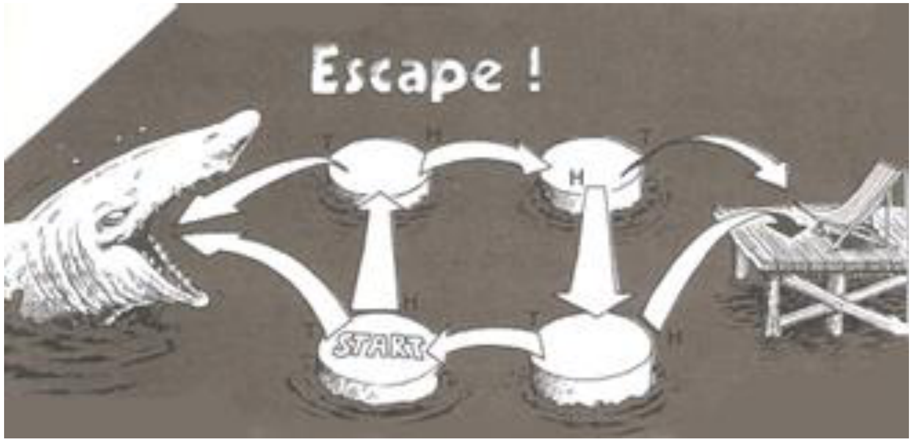

## Enunciado

Marina ha ideado un juego al que le ha puesto como nombre ESCAPE.

Para comenzar el juego se sitúa en la casilla de salida «START» y lanza una moneda: si sale cara avanza en la dirección H a la casilla siguiente, y si sale cruz, en la dirección T. Así debe seguir lanzando la moneda hasta que escapa y descansa en la tumbona o se la come el tiburón, acabando entonces el juego.

**Contesta razonando las respuestas:**

a) ¿Cuál es la probabilidad de escaparse lanzando 3 veces la moneda?

b) ¿Y cuál sería la probabilidad de escaparse si hemos lanzado 8 veces la moneda?

c) Marina lleva tres horas jugando la misma partida y ni descansa ni se la comen. ¿Qué le ha podido suceder?

## Solución

La moneda no está trucada, así que cara y cruz tienen probabilidad $\frac{1}{2}$ cada una. Llamamos casilla 1 a «START» y casillas 2, 3 y 4 a las demás, en el sentido de las agujas del reloj.

a) Para escapar en exactamente 3 lanzamientos hay que sacar cara (de la casilla 1 a la 2), cara (de la 2 a la 3) y cruz (de la 3 a la tumbona):

$$P(H_1 \cap H_2 \cap T_3) = \frac{1}{2} \cdot \frac{1}{2} \cdot \frac{1}{2} = \frac{1}{8}.$$

b) En 8 lanzamientos hay que dar una vuelta completa (cara, cara, cara y cruz, que devuelve a «START») y después cara, cara y cruz:

$$P = \left(\frac{1}{2}\right)^8 = \frac{1}{256}.$$

c) Ha repetido una y otra vez el ciclo que la devuelve a la casilla de salida (cara, cara, cara, cruz), sin llegar nunca a la tumbona ni caer en la boca del tiburón.
