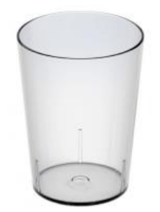

## Enunciado

Debido a la ola de calor que estamos sufriendo en Andalucía como consecuencia del cambio climático, el Servicio Andaluz de Salud (SAS) ha recomendado, para evitar posibles deshidrataciones y así mantenernos sanos, la ingesta diaria de 6 vasos de agua.

Las dimensiones del vaso estándar tomado como referencia son:

- diámetro del fondo del vaso: 6 cm;
- diámetro de la boca del vaso: 8 cm;
- altura del vaso: 9 cm.

¿Qué cantidad de botellas de agua de 1,5 litros cada una debo comprar si quiero tener el agua suficiente para el consumo recomendado por el SAS durante una semana?

**Razona tu respuesta.**

## Solución

Una botella tiene $1{,}5\ \text{dm}^3 = 1500\ \text{cm}^3$. El vaso es un tronco de cono: su volumen es el del cono completo menos el del cono que le falta.

Llamamos $x$ a la altura del cono que falta (radio de la base 3 cm); el cono completo tiene radio 4 cm y altura $x + 9$. Los triángulos que forman radios y alturas están en posición de Thales, así que

$$\frac{3}{x} = \frac{4}{x + 9} \;\Rightarrow\; 4x = 3x + 27 \;\Rightarrow\; x = 27\ \text{cm},$$

y el cono completo mide 36 cm de alto. Entonces

$$V_{\text{vaso}} = \frac{\pi \cdot 4^2 \cdot 36}{3} - \frac{\pi \cdot 3^2 \cdot 27}{3} = 192\pi - 81\pi = 111\pi \approx 348{,}72\ \text{cm}^3.$$

En una semana se beben $6 \cdot 7 = 42$ vasos, es decir, $42 \cdot 348{,}72 \approx 14\,646\ \text{cm}^3$, y $14\,646 : 1500 \approx 9{,}76$ botellas. Hay que comprar **10 botellas**.
