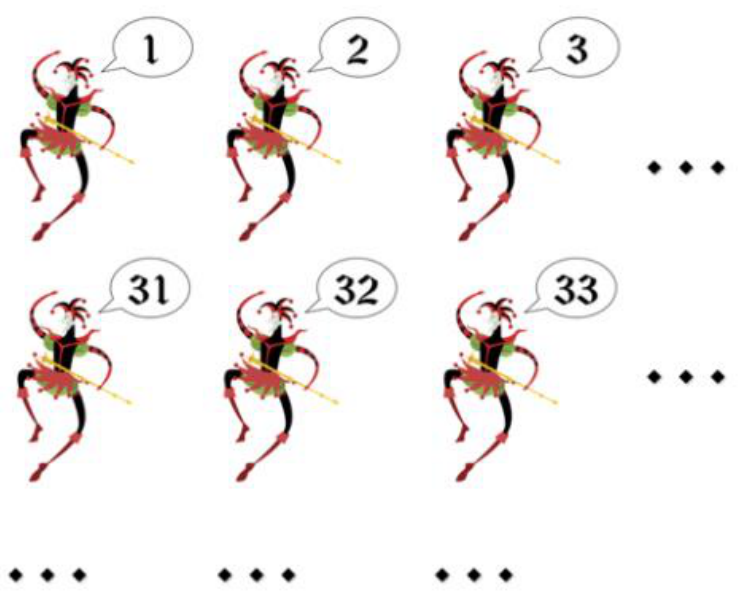

## Enunciado

Para el Carnaval del próximo año 2023, los 990 socios de Thales van a formar una comparsa que desfilará por las calles de Cádiz. Cada socio tiene un número que le permitirá conocer su lugar a la hora de formar, y lo harán formados en 33 filas y 30 columnas, de forma que los comparsistas quedarán como muestra la figura.

En los ensayos, dos componentes, Esther y Salvador, se encuentran en la quinta columna, y ninguno está en la primera fila. Sin embargo, se dan cuenta de que podrían desfilar formados en 30 filas y 33 columnas, acortando así un poco el tiempo del desfile. En esta nueva reubicación, Esther y Salvador siguen estando en la quinta columna.

**Contesta razonadamente:** ¿qué números eran los que llevaban asignados Esther y Salvador?

## Solución

Con 30 columnas, el socio número $N$ está en la columna que indica el resto de dividir $N$ entre 30 (la columna 30 si el resto es 0). Con 33 columnas, en la columna que indica el resto de dividir $N$ entre 33.

Esther y Salvador están en la quinta columna en las dos formaciones, así que sus números dan resto 5 al dividirlos entre 30 y entre 33. Por tanto, $N - 5$ es múltiplo común de 30 y de 33, es decir, múltiplo de $\text{m.c.m.}(30, 33) = 330$:

$$N = 5, \quad 335, \quad 665 \quad (995 \text{ ya no vale, porque solo hay 990 socios}).$$

El 5 está en la primera fila, así que se descarta. Esther y Salvador llevan los números **335 y 665**.
