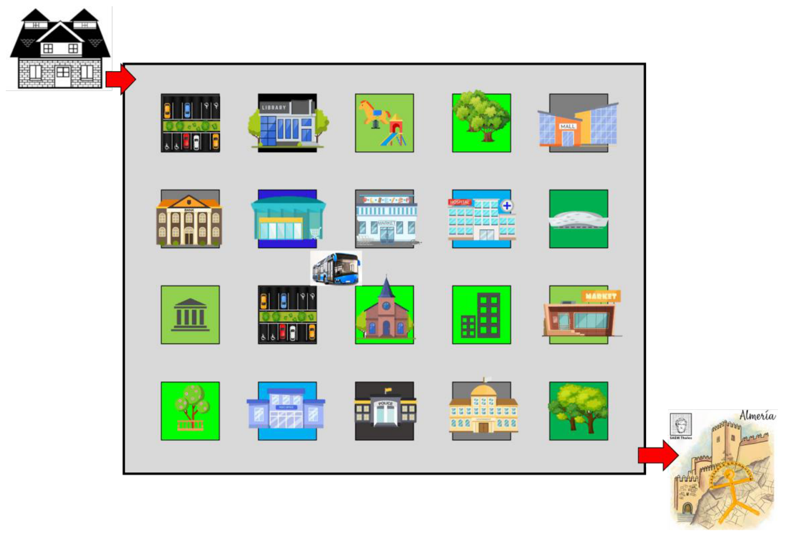
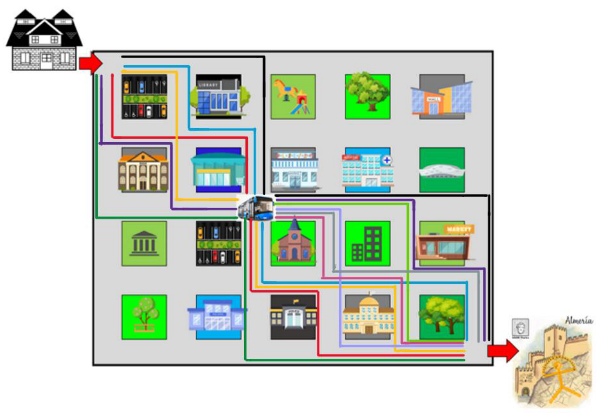

## Enunciado

El día 17 de mayo de 2023, Ana participará en la XXXVIII Olimpiada Matemática Thales. Para ello, sus padres la llevarán a la parada del autobús que la llevará a Almería, lugar donde se celebrará la fase regional de la olimpiada. El mapa con los puntos de interés es el que se muestra, y los caminos tienen que cumplir la siguiente condición: solo puede desplazarse hacia la derecha y hacia abajo.

a) Deduce cuántos caminos podría seguir para llegar a la parada del autobús.

b) ¿Cuántos caminos hay de la parada del autobús hasta Almería?

c) Y en total, ¿cuántos posibles caminos podría elegir para ir de su casa hasta Almería pasando por la parada del autobús?

**Explica cómo has descubierto tus respuestas.**

## Solución

Trazamos todos los caminos posibles, moviéndonos solo hacia la derecha y hacia abajo:

a) De la casa a la parada del autobús hay **6 caminos**.

b) De la parada del autobús a Almería hay **10 caminos**.

c) Cada uno de los 6 caminos de la primera parte se puede combinar con cada uno de los 10 de la segunda: en total hay $6 \cdot 10 = \mathbf{60}$ caminos.
