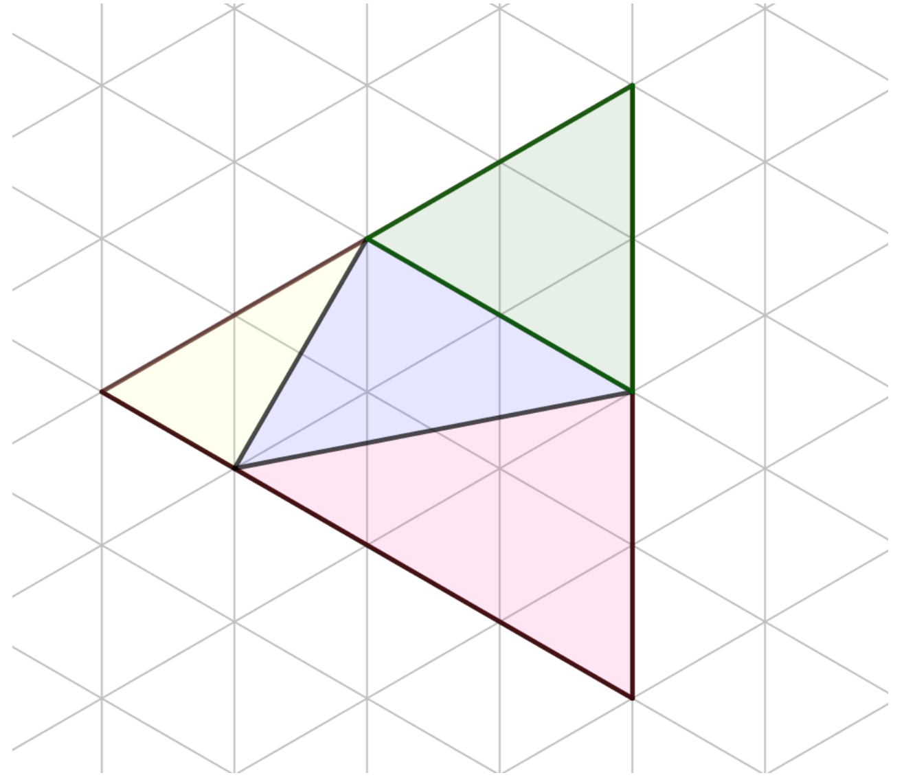
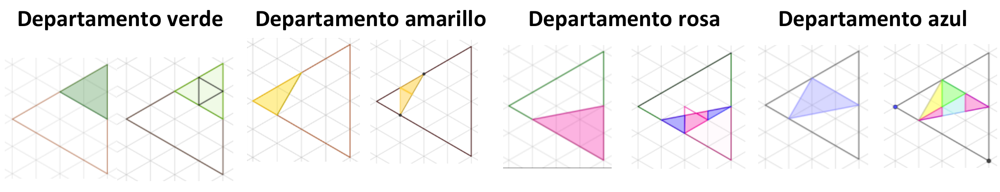
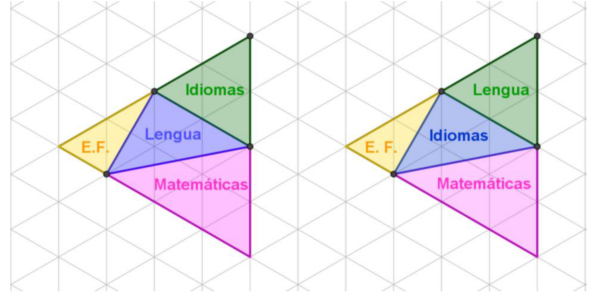

## Enunciado

El instituto de María se ha ampliado con un edificio nuevo de 80 m² de superficie como el que se ve representado en el dibujo. En él se van a situar los departamentos de Matemáticas, Lengua, Idiomas y Educación Física. Para el reparto de los departamentos didácticos se deben cumplir las siguientes condiciones:

- El de Matemáticas necesita la mayor superficie posible para montar un taller de material manipulable.
- El de Educación Física es el que necesita menos espacio, ya que dispone también del gimnasio.

a) ¿Es posible repartir los departamentos? ¿Cómo lo harías?

b) ¿Cuántos metros cuadrados tiene cada uno de los despachos?

**Explica cómo has descubierto tus respuestas.**

## Solución

El edificio ocupa 16 triángulos pequeños de la trama, así que cada triángulo pequeño mide

$$\frac{80}{16} = 5\ \text{m}^2.$$

Contamos los triángulos pequeños de cada zona, juntando los trozos cuando hace falta:

| Zona | Triángulos pequeños | Superficie |
|---|---|---|
| Verde | 4 | $4 \cdot 5 = 20\ \text{m}^2$ |
| Amarilla | 2 (uno completo y otro formado por dos mitades) | $2 \cdot 5 = 10\ \text{m}^2$ |
| Rosa | 6 (4 completos y 2 formados uniendo trozos) | $6 \cdot 5 = 30\ \text{m}^2$ |
| Azul | 4 (1 completo y 3 formados uniendo trozos) | $4 \cdot 5 = 20\ \text{m}^2$ |

Reparto:

- Matemáticas, que necesita más espacio, ocupa la zona **rosa** (30 m²).
- Educación Física, que necesita menos, ocupa la zona **amarilla** (10 m²).
- Lengua e Idiomas tienen la misma superficie (20 m²) y se pueden repartir indistintamente las zonas verde y azul, así que hay **dos soluciones**:

