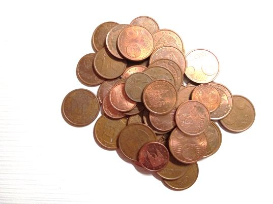

## Enunciado

En una caja con muchas monedas de 1, 2 y 5 céntimos, Laura y Enrique toman un total de 100 monedas cada uno. Sabemos que Laura tiene el doble de monedas de 2 céntimos que de 1 céntimo, y que Enrique tiene el triple de monedas de 2 céntimos que de 1 céntimo.

Si sabemos que Laura tiene un total de 3 euros, ¿sería posible que en sus 100 monedas tuviera al menos 8 monedas de un céntimo?

Sabemos que Enrique tiene el mismo número de monedas de 5 céntimos que Laura. ¿Podría tener exactamente 3 € entre sus 100 monedas?

**Explica cómo has descubierto tus respuestas.**

## Solución

**Laura.** Si tuviera exactamente 8 monedas de 1 céntimo, tendría $2 \cdot 8 = 16$ de 2 céntimos y $100 - 8 - 16 = 76$ de 5 céntimos, en total $0{,}08 + 0{,}32 + 3{,}80 = 4{,}20$ €: se pasa de 3 €. Probemos con más monedas de 1 céntimo:

| 1 cént. | 2 cént. | 5 cént. | Total |
|---|---|---|---|
| 1 | 2 | 97 | 4,90 € |
| 2 | 4 | 94 | 4,80 € |
| … | … | … | … |
| 8 | 16 | 76 | 4,20 € |
| 10 | 20 | 70 | 4,00 € |
| … | … | … | … |
| 20 | 40 | 40 | 3,00 € |

Cada moneda más de 1 céntimo (con sus dos de 2 céntimos) sustituye a tres de 5 céntimos, y el total baja 10 céntimos. Si con 10 monedas de 1 céntimo hay 4 €, para llegar a 3 € hacen falta 20.

Con una ecuación: si $x$ es el número de monedas de 1 céntimo,

$$x + 2 \cdot 2x + 5\,(100 - 3x) = 300 \;\Rightarrow\; -10x = -200 \;\Rightarrow\; x = 20.$$

Así que **sí**: Laura tiene 20 monedas de 1 céntimo (más de 8), 40 de 2 céntimos y 40 de 5 céntimos.

**Enrique.** Tiene, como Laura, 40 monedas de 5 céntimos (2 €), así que las otras 60 monedas deberían sumar 1 €. Con el triple de monedas de 2 céntimos que de 1 céntimo, serían 15 de 1 céntimo y 45 de 2 céntimos: $0{,}15 + 0{,}90 = 1{,}05$ €. El total sería $3{,}05$ €, **no** 3 €.

En general, cada moneda de 1 céntimo va acompañada de tres de 2 céntimos, y el grupo vale $1 + 3 \cdot 2 = 7$ céntimos. Por eso Enrique solo puede llegar a cantidades como las de esta tabla, y ninguna es exactamente 3 €:

| 1 cént. | 2 cént. | 5 cént. | Total |
|---|---|---|---|
| 1 | 3 | 96 | 4,87 € |
| 5 | 15 | 80 | 4,35 € |
| 10 | 30 | 60 | 3,70 € |
| 15 | 45 | 40 | 3,05 € |
| 20 | 60 | 20 | 2,40 € |
