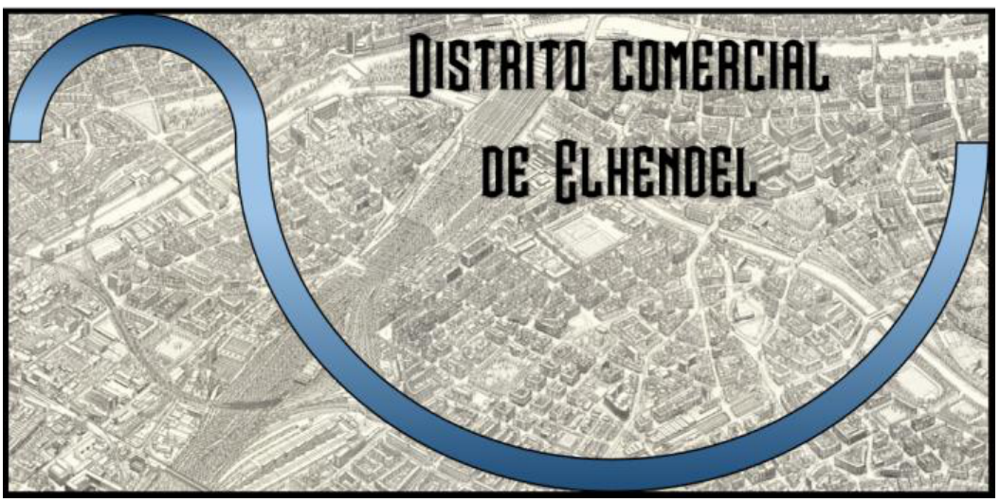
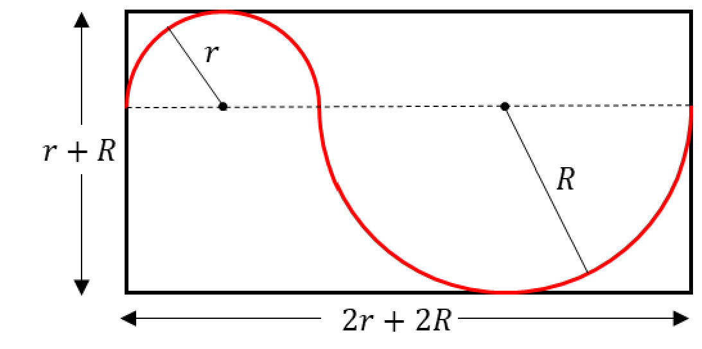

## Enunciado

Whax es el promotor de un nuevo distrito comercial en la ciudad de Elhendel. Este distrito tendrá una forma rectangular y será atravesado por el canal de la ciudad, formado por dos semicircunferencias, que tiene una longitud de 15,20 kilómetros, tal y como muestra el siguiente mapa.

Su compañero, Weyn, quiere averiguar cuál será el perímetro del distrito, para poder hacer algunos cálculos más.

Calcula el perímetro del nuevo distrito comercial de Elhendel.

**Explica cómo has descubierto tus respuestas.**

## Solución

Llamamos $r$ y $R$ a los radios menor y mayor de las dos semicircunferencias que forman el canal. Como muestra la figura, la base del rectángulo mide $2r + 2R$ y su altura $r + R$:

El perímetro del distrito es

$$P = 2\,(r + R) + 2\,(2r + 2R) = 6r + 6R = 6\,(r + R).$$

Para hallar $r + R$ usamos la longitud del canal. Una semicircunferencia de radio $r$ mide $\pi r$, así que

$$15{,}2 = \pi r + \pi R = \pi\,(r + R) \;\Rightarrow\; r + R = \frac{15{,}2}{\pi} \approx 4{,}8383\ \text{km}.$$

Por tanto,

$$P = 6 \cdot \frac{15{,}2}{\pi} \approx 29{,}0299\ \text{km}.$$

Redondeando a las milésimas, el perímetro del distrito es **29,030 km**, es decir, 29 030 m.
