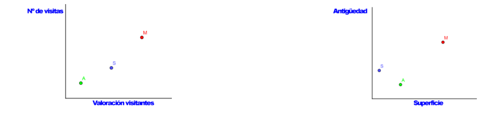
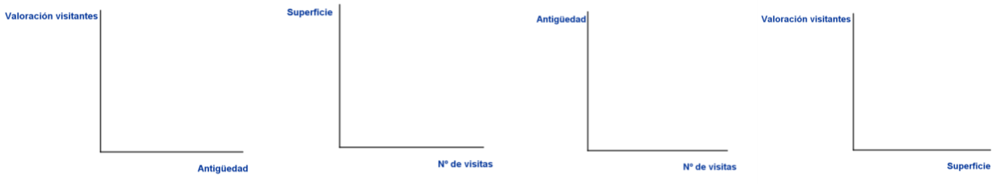
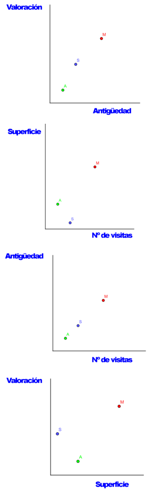

## Enunciado

Las siguientes gráficas describen tres monumentos de Córdoba: **A)** Alcázar de los Reyes Cristianos, **M)** Mezquita y **S)** Sinagoga.

¿Cuál de los tres monumentos es el más visitado? ¿Y el que tiene menor superficie?

Teniendo en cuenta que las gráficas no están hechas con exactitud, completa las siguientes gráficas marcando en cada una los tres puntos A, M y S.

**Explica cómo has descubierto tus respuestas.**

## Solución

Graduamos las gráficas del enunciado para asignar un valor aproximado a cada magnitud:

| | Valoración | N.º de visitas | Superficie | Antigüedad |
|---|---|---|---|---|
| Alcázar (A) | 1 | 1 | 2 | 1 |
| Sinagoga (S) | 3 | 2 | 0,5 | 2 |
| Mezquita (M) | 5 | 4 | 5 | 4 |

- El monumento **más visitado** es la **Mezquita**.
- El monumento con **menor superficie** es la **Sinagoga**.

Con estos valores se completan las cuatro gráficas pedidas:

