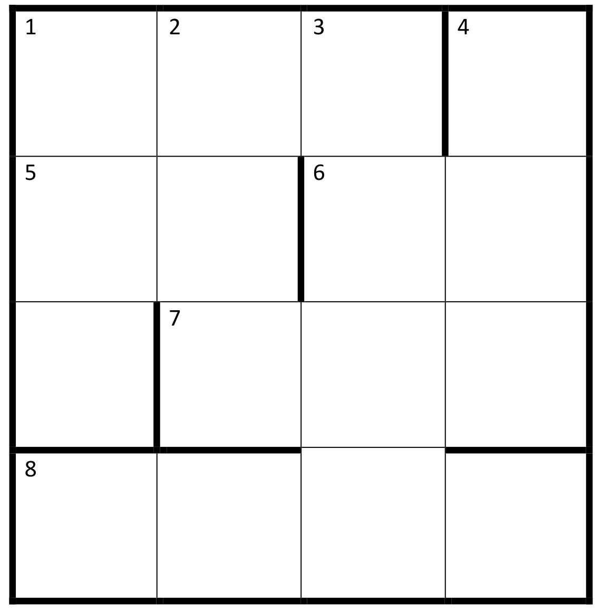
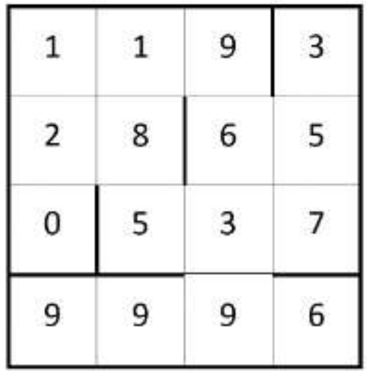

## Enunciado

Los pasatiempos del periódico *El Heraldo Matelandés* cada vez son más raros. Tanto es así que en los crucigramas unas definiciones dependen de otras. Sergio está enfrascado en la resolución de este.

Ayúdale a completar este crucigrama, **explicando paso a paso tu razonamiento**.

**Horizontales**

- **1:** Un tercio del 4 vertical.
- **5:** El 6 horizontal escrito al revés y dividido por 2.
- **6:** Ver el 5 horizontal.
- **7:** Un número con las mismas cifras que el 4 vertical.
- **8:** El 4 vertical multiplicado por 28.

**Verticales**

- **1:** El 2 vertical menos el 6 horizontal.
- **2:** Ver el 1 vertical.
- **3:** El 8 horizontal menos el 4 vertical.
- **4:** Un número con cifras impares diferentes escritas de menor a mayor.

## Solución

Por (1H), el 4V es múltiplo de 3, así que sus cifras suman un múltiplo de 3. Por (4V) es un número de tres cifras impares distintas en orden creciente. De las posibilidades (135, 137, 139, 157, 159, 179, 357, 359, 379, 579) solo son múltiplos de 3 **135, 159, 357 y 579**.

Por (8H), el 8H es el 4V multiplicado por 28:

$$135 \cdot 28 = 3780, \quad 159 \cdot 28 = 4452, \quad 357 \cdot 28 = 9996, \quad 579 \cdot 28 = 16\,212.$$

La última no cabe en cuatro casillas. Por (3V), el 3V es la diferencia entre 8H y 4V:

$$3780 - 135 = 3645, \quad 4452 - 159 = 4293, \quad 9996 - 357 = 9639.$$

El 3V y el 8H comparten una casilla (la última cifra del 3V es la tercera del 8H), y solo coinciden en la tercera opción. Por tanto, **4V = 357, 8H = 9996 y 3V = 9639**.

Ahora:

- $1H = 357 : 3 = 119$.
- El 6H termina en 5 (lo da el 4V) y empieza en 6 (lo da el 3V): 6H = 65. Por (5H), $5H = 56 : 2 = 28$.
- El 7H tiene las mismas cifras que el 4V; le falta un **5**: 7H = 537.
- La primera cifra que falta sale de (1V): $1V = 2V - 6H = 185 - 65 = 120$.

El crucigrama queda así:

