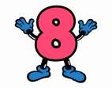

## Enunciado

D. Salvador ha prometido un premio al alumno o alumna que, sin usar la calculadora, le entregue el primero el resultado de la siguiente suma de ochos.

Hay que sumar los quince números siguientes: 8, 88, 888, 8888, 88 888, …; el último número está formado por 15 cifras, todas ellas 8.

Explica de forma razonada cómo has hallado el resultado de la suma.

## Solución

**Método 1: sumar por columnas.** Colocamos los 15 números uno debajo de otro. En la columna de las unidades hay 15 ochos ($8 \cdot 15 = 120$: se escribe 0 y nos llevamos 12); en la de las decenas, 14 ochos más lo que nos llevamos ($8 \cdot 14 + 12 = 124$: se escribe 4 y nos llevamos 12); y así sucesivamente, columna a columna.

**Método 2: sacar 8 factor común.** La suma es $8 \cdot (1 + 11 + 111 + \dots + \underbrace{11\ldots1}_{15})$. En la suma de los «unos», la columna de las unidades suma 15, la de las decenas 14 más 1 que nos llevamos, la de las centenas 13 más 1, etc.:

$$1 + 11 + 111 + \dots + \underbrace{11\ldots1}_{15} = 123\,456\,790\,123\,455.$$

Multiplicando por 8:

$$8 \cdot 123\,456\,790\,123\,455 = \mathbf{987\,654\,320\,987\,640}.$$

**Método 3: agrupar por parejas.** Tras sacar el 8 factor común se pueden agrupar los sumandos de dos en dos ($11 + 111 = 122$, $1111 + 11\,111 = 12\,222$, …), con lo que cada resultado tiene dos cifras 2 más que el anterior; se suman esos resultados y se multiplica por 8.
